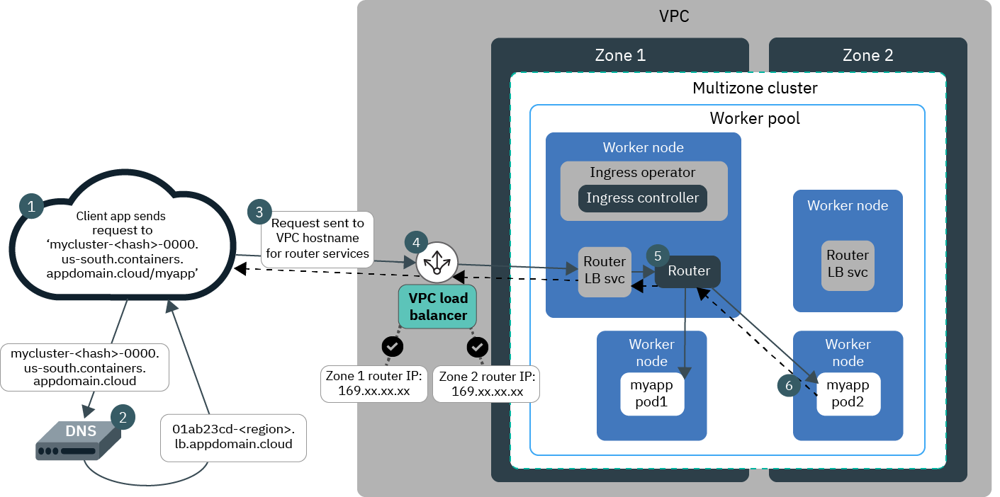
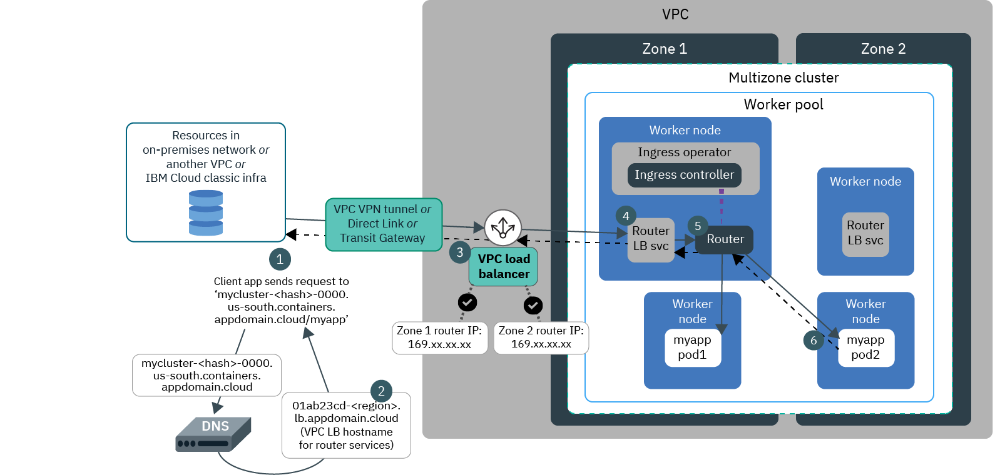

---

copyright:
  years: 2014, 2021
lastupdated: "2021-09-10"

keywords: openshift, roks, rhoks, rhos, nginx, ingress controller, ingress operator, router

subcollection: openshift

---

{{site.data.keyword.attribute-definition-list}}  

# About Ingress
{: #ingress-about-roks4}

 This information is for clusters that run {{site.data.keyword.openshiftshort}} version 4 only.
{: note}

Ingress is a service that balances network traffic workloads in your cluster by forwarding public or private requests to your apps. You can use Ingress to expose multiple app services to the public or to a private network by using a unique public or private domain.
{: shortdesc}

In your cluster, the {{site.data.keyword.openshiftshort}} router is a layer 7 load balancer which implements an HAProxy Ingress controller. A layer 4 `LoadBalancer` service exposes the router so that the router can receive external requests that come into your cluster. The router then forwards requests to app pods in your cluster based on distinguishing layer 7 protocol characteristics, such as headers.

## What are the components of Ingress?
{: #ingress_roks4_components}

In clusters that run {{site.data.keyword.openshiftshort}} version 4, Ingress consists of three components: an Ingress controller, a router, and Ingress resources.
{: shortdesc}

### Ingress controller
{: #ingress-controller}

The [{{site.data.keyword.openshiftshort}} Ingress controller](https://docs.openshift.com/container-platform/4.6/networking/ingress-operator.html){: external} implements routing rules that are applied to all incoming traffic for the apps in your cluster.
{: shortdesc}

Ingress controllers are managed by the Ingress operator. During cluster creation, the default Ingress controller is registered with the default Ingress subdomain for your cluster in the format `<cluster_name>.<globally_unique_account_HASH>-0000.<region>.containers.appdomain.cloud`. When you register your app with this subdomain by creating an Ingress resource, the Ingress controller ensures that requests to your app through this subdomain are properly proxied to your app pods. To see the default Ingress controller in your cluster, run `oc describe ingresscontroller/default -n openshift-ingress-operator`.

If you want to register your app with a different domain, you can [create a custom Ingress controller](/docs/openshift?topic=openshift-ingress-roks4#ingress-roks4-public-2) that implements routing rules for a custom domain instead.

### Router
{: #ingress-router}

One HAProxy-based {{site.data.keyword.openshiftshort}} router is created for each Ingress controller, and one router service is created in each zone where you have worker nodes.
{: shortdesc}

The Ingress operator configures the router with the same domain that is specified in the Ingress controller. The router listens for incoming HTTP, HTTPS, or TCP service requests through that domain. The router's load balancer service component then forwards requests to the pods for that app only according to the rules defined in the Ingress resource and implemented by the Ingress controller.

If you have a multizone cluster, one high-availability router is deployed to your cluster and is configured with a multizone VPC load balancer. Two worker nodes are required per zone so that the two replicas of the router can be deployed and updated correctly.

If you manually create a router, the router is not managed by the Ingress operator and is not automatically registered with the Ingress subdomain or an app in your cluster.
{: note}

 **Classic clusters: Router IP addresses**

To find the IP addresses of the default Ingress controller router services, run `oc get svc -n openshift-ingress` and look for the **EXTERNAL IP** field. If you have a multizone cluster, note that the router service in the first zone where you have workers nodes is always named `router-default`, and router services in the zones that you subsequently add to your cluster have names such as `router-dal12`.

 **VPC clusters: Router hostnames**

When you create a VPC cluster, one public and one private multizone VPC load balancer are automatically created outside of your cluster in your VPC. The public VPC load balancer creates a hostname to register the public router, and the private VPC load balancer creates a hostname to register the private router. In VPC clusters, a hostname is assigned to the routers because external IP addresses are not static and might change over time. Note that this router hostname is different than the default Ingress subdomain for your cluster.

The Ingress subdomain for your cluster is automatically linked to the VPC load balancer hostname for your public router. Note that the Ingress subdomain for your cluster, which looks like `<cluster_name>.<hash>-0000.<region>.containers.appdomain.cloud`, is different than the VPC load balancer-assigned hostname for your public router, which looks like `01ab23cd-<region>.lb.appdomain.cloud`. The Ingress subdomain is the public route through which users access your app from the internet, and can be configured to use TLS termination. The assigned hostname for your public router is what the VPC load balancer uses to forward traffic to the router service.

You can find the hostname that is assigned to your public router and the hostname that is assigned to your private router by running `oc get svc -n openshift-ingress` and looking for the **EXTERNAL IP** field.

In your VPC infrastructure dashboard, the VPC load balancer reports as healthy only the two worker nodes that run the router replica pods, because these worker nodes are configured as the listeners for the VPC load balancer. Even though only the listener worker nodes are reported as healthy, the listeners' backend pool of worker nodes is kept up-to-date by {{site.data.keyword.openshiftlong_notm}} so that all worker nodes in your cluster can still receive requests from the VPC load balancer.
{: note}

### Ingress resource
{: #ingress-resource-about}

To expose an app by using Ingress, you must create a Kubernetes service for your app and register this service with the Ingress controller by defining an Ingress resource. The Ingress resource is a Kubernetes resource that defines the rules for how to route incoming requests for apps.
{: shortdesc}

The Ingress resource also specifies the path to your app services. The paths to your app services are appended to your cluster's Ingress subdomain to form a unique app URL such as `mycluster-a1b2cdef345678g9hi012j3kl4567890-0000.us-south.containers.appdomain.cloud/myapp1`.

One Ingress resource is required for each project where you have apps that you want to expose.
* If the apps in your cluster are all in the same project, you must create one Ingress resource to define the routing rules for the apps that you want to expose. Note that if you want to use different domains for the apps within the same project, you can create one resource per domain.
* If the apps in your cluster are in different projects, you must create one Ingress resource for each project to define the app's routing rules.

For more information, see [Planning networking for single or multiple projects](/docs/openshift?topic=openshift-ingress-roks4#multiple_projects).

If you want to customize routing rules for your app, you can use [route-specific HAProxy annotations](/docs/openshift?topic=openshift-ingress-roks4#annotations-roks4) that manages traffic for your app. These supported annotations are in the format `haproxy.router.openshift.io/<annotation>`  or `router.openshift.io/<annotation>`. Note that {{site.data.keyword.containerlong_notm}} annotations (`ingress.bluemix.net/<annotation>`) and NGINX annotations (`nginx.ingress.kubernetes.io/<annotation>`) are not supported for the router or the Ingress resource in {{site.data.keyword.openshiftshort}} version 4.
{: important}

 

## How does a request get to my app in a classic cluster?
{: #roks4-flow}

### Single-zone cluster
{: #classic-single-roks4}

 The following diagram shows how Ingress directs communication from the internet to an app in a classic single-zone cluster.
{: shortdesc}

1. A user sends a request to your app by accessing your app's URL. This URL is the Ingress subdomain for your cluster appended with the Ingress resource path for your exposed app, such as `mycluster-<hash>-0000.us-south.containers.appdomain.cloud/myapp`.

2. A DNS system service resolves the subdomain in the URL to the portable public IP address of the load balancer that exposes the router in your cluster.

3. Based on the resolved IP address, the client sends the request to the router service.

4. The router checks the routing rules that are implemented by the Ingress controller for a routing rule for the `myapp` path. If a matching rule is found, the request is proxied according to the rules that you defined in the router and the Ingress resource to the pod where the app is deployed. The source IP address of the packet is changed to the IP address of the worker node where the router pod runs. If multiple app instances are deployed in the cluster, the router load balances the requests between the app pods.

5. When the app returns a response packet, it uses the IP address of the worker node where the router that forwarded the request exists. The router then sends the response packet to the client.

### Multizone cluster
{: #classic-multi-roks4}

 The following diagram shows how Ingress directs communication from the internet to an app in a classic multizone cluster.
{: shortdesc}

1. A user sends a request to your app by accessing your app's URL. This URL is the Ingress subdomain for your cluster appended with the Ingress resource path for your exposed app, such as `mycluster-<hash>-0000.us-south.containers.appdomain.cloud/myapp`.

2. A DNS system service resolves the route subdomain to the floating public IP address of a router service that was reported as healthy by the MZLB. The MZLB continuously checks the portable public IP addresses of the services that expose the router in each zone in your cluster. Requests are handled by the router services in various zones in a round-robin cycle.

3. The client sends the request to the IP address of the service that exposes the router.

4. The router checks the routing rules that are implemented by the Ingress controller for the `myapp` path. If a matching rule is found, the request is proxied according to the rules that you defined in the router and the Ingress resource to the pod where the app is deployed. The source IP address of the packet is changed to the IP address of the worker node where the router pod runs. If multiple app instances are deployed in the cluster, the router service sends the requests between the app pods across all zones.

5. When the app returns a response packet, it uses the IP address of the worker node where the router service that forwarded the request exists. The router then sends the response packet to the client.

## How does a request get to my app in a VPC cluster?
{: #architecture-vpc}

### VPC cluster with a public cloud service endpoint
{: #architecture-vpc_public}

 When you create a multizone VPC cluster with the public cloud service endpoint enabled, a public Ingress controller and router are created by default. The following diagram shows how Ingress directs communication from the internet to an app in a VPC multizone cluster.
{: shortdesc}

1. A user sends a request to your app by accessing your app's URL. This URL is the Ingress subdomain for your cluster for your exposed app appended with the Ingress resource path, such as `mycluster-<hash>-0000.us-south.containers.appdomain.cloud/myapp`.

2. A DNS service resolves the route subdomain to the VPC load balancer hostname that is assigned to the router. In VPC clusters, the external IP addresses are floating, and are kept behind a VPC-assigned hostname.

3. The VPC load balancer resolves the VPC hostname to an available IP address in a zone for the router that was reported as healthy. The VPC load balancer continuously checks the external IP addresses for the router in each zone in your cluster.

4. Based on the resolved IP address, the VPC load balancer sends the request to a router.

5. The router checks the routing rules that are implemented by the Ingress controller for the `myapp` path. If a matching rule is found, the request is proxied according to the rules that you defined in the router and the Ingress resource to the pod where the app is deployed. The source IP address of the packet is changed to the IP address of the worker node where the router pod runs. If multiple app instances are deployed in the cluster, the router load balances the requests between the app pods across all zones.

6. When the app returns a response packet, it uses the IP address of the worker node where the router service that forwarded the request exists. The VPC load balancer then sends the response packet to the client.

### VPC cluster with a private cloud service endpoint only
{: #architecture-vpc_private}

 When you create a multizone VPC cluster with the private cloud service endpoint only, a private Ingress controller and router are created by default. Only clients that are connected to your private VPC network can access apps that are exposed by a private Ingress controller. The following diagram shows how Ingress directs communication from private networks to an app in a VPC multizone cluster.
{: shortdesc}

1. A client that is connected to your private VPC network sends a request to your app by using your app's URL. This URL is the Ingress subdomain for your cluster for your exposed app appended with the Ingress resource path, such as `mycluster-<hash>-i000.us-south.containers.appdomain.cloud/myapp`. For example, you might use the Virtual Private Cloud VPN, {{site.data.keyword.tg_full_notm}}, or {{site.data.keyword.dl_full_notm}} to allow requests from an on-premises network, another VPC, or {{site.data.keyword.cloud_notm}} classic infrastructure to apps that run in your cluster.

2. A DNS service resolves the route subdomain to the VPC load balancer hostname that is assigned to the services for the router. In VPC clusters, your router services' private IP addresses are floating, and are kept behind a VPC-assigned hostname. Note that though the DNS record for the route subdomain is registered in the public DNS system, the DNS resolution servers are reachable from the VPC.

3. The private VPC load balancer resolves the VPC hostname to an available private IP address of a router service that was reported as healthy. The VPC load balancer continuously checks the IP addresses of the services that expose the router in each zone in your cluster.

4. Based on the resolved IP address, the VPC load balancer sends the request to a router service.

5. The router checks the routing rules that are implemented by the Ingress controller for the `myapp` path. If a matching rule is found, the request is proxied according to the rules that you defined in the router and the Ingress resource to the pod where the app is deployed. The source IP address of the packet is changed to the IP address of the worker node where the router pod runs. If multiple app instances are deployed in the cluster, the router load balances the requests between the app pods across all zones.

6. When the app returns a response packet, it uses the IP address of the worker node where the router that forwarded the client request exists. The router then sends the response packet through the VPC load balancer to the client.

 

## How can I customize routing?
{: #custom-routing}

If you want to customize routing rules for your app, you can use [route-specific HAProxy annotations](https://docs.openshift.com/container-platform/4.6/networking/routes/route-configuration.html#nw-route-specific-annotations_route-configuration){: external} that manages traffic for your app.

These supported annotations are in the format `haproxy.router.openshift.io/<annotation>` or `router.openshift.io/<annotation>`.

{{site.data.keyword.containerlong_notm}} annotations (`ingress.bluemix.net/<annotation>`) and NGINX annotations (`nginx.ingress.kubernetes.io/<annotation>`) are **not** supported for the router, Ingress controller, or the Ingress resource in {{site.data.keyword.openshiftshort}} version 4.

To get started, see [Customizing Ingress routing with annotations](/docs/openshift?topic=openshift-ingress-roks4#annotations-roks4).

 

## How can I enable TLS certificates?
{: #certs}

To load balance incoming HTTPS connections to your subdomain, you can configure the Ingress controller for your router to decrypt the network traffic and forward the decrypted request to the apps that are exposed in your cluster.
{: shortdesc}

When you configure the public router, you choose the domain that your apps are accessible through. If you use the IBM-provided domain, such as `mycluster-<hash>-0000.us-south.containers.appdomain.cloud/myapp`, you can use the default TLS certificate that is created for the Ingress subdomain. If you set up a CNAME record to map a custom domain to the IBM-provided domain, you can provide your own TLS certificate for your custom domain.

For more information about TLS certificates, see [Managing TLS certificates and secrets](/docs/openshift?topic=openshift-ingress-roks4#manage_certs).

