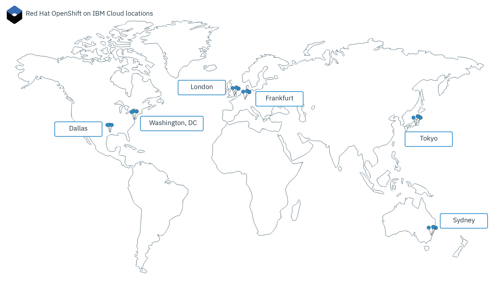

---

copyright:
  years: 2014, 2020
lastupdated: "2020-02-06"

keywords: openshift, roks, rhoks, rhos, mzr, szr, multizone, multi az

subcollection: openshift

---

{:codeblock: .codeblock}
{:deprecated: .deprecated}
{:download: .download}
{:external: target="_blank" .external}
{:faq: data-hd-content-type='faq'}
{:gif: data-image-type='gif'}
{:help: data-hd-content-type='help'}
{:important: .important}
{:new_window: target="_blank"}
{:note: .note}
{:pre: .pre}
{:preview: .preview}
{:screen: .screen}
{:shortdesc: .shortdesc}
{:support: data-reuse='support'}
{:table: .aria-labeledby="caption"}
{:tip: .tip}
{:troubleshoot: data-hd-content-type='troubleshoot'}
{:tsCauses: .tsCauses}
{:tsResolve: .tsResolve}
{:tsSymptoms: .tsSymptoms}


# Locations
{: #regions-and-zones}

You can deploy {{site.data.keyword.openshiftlong}} clusters worldwide. When you create a cluster, its resources remain in the location that you deploy the cluster to. To work with your cluster, you can access the service via a global API endpoint.
{:shortdesc}



_Red Hat OpenShift on IBM Cloud locations_


## Red Hat OpenShift on IBM Cloud locations
{: #locations}

{{site.data.keyword.cloud_notm}} resources are organized into a hierarchy of geographic locations. Red Hat OpenShift on IBM Cloud is available in a subset of these locations, including all six worldwide multizone-capable regions and select single zone regions. Other {{site.data.keyword.cloud_notm}} services might be available globally or within a specific location.
{: shortdesc}


### How locations are organized
{: #example_locations_org}

The following image is used as an example to explain how Red Hat OpenShift on IBM Cloud locations are organized.
{: shortdesc}


|Type|Example|Description|
|--- |--- |--- |
|Geography|North America (`na`)|An organizational grouping that is based on geographic continents.|
|Country|Canada (`ca`)|The location's country within the geography.|
|Metro|Mexico City (`mex-cty`), Dallas (`dal`)|The name of a city where 1 or more data centers (zones) are located. A metro can be multizone-capable and have multizone-capable data centers, such as Dallas, or can have only single zone data centers, such as Mexico City. If you create a cluster in a multizone-capable metro, the Kubernetes master and worker nodes can be spread across zones for high availability.|
|Data center (zone)|Dallas 12 (`dal12`)|A physical location of the compute, network, and storage infrastructure and related cooling and power that host cloud services and applications. Clusters can be spread across data centers, or zones, in an multizone architecture for high availability. Zones are isolated from each other, which ensures no shared single point of failure.|
{: caption="Organization of Red Hat OpenShift on IBM Cloud locations."}

### Single and multizone locations in Red Hat OpenShift on IBM Cloud
{: #zones}

The following tables list the available single and multizone locations in Red Hat OpenShift on IBM Cloud.
{: shortdesc}

* **Multizone**: If you create a cluster in a multizone metro location, the replicas of your highly available Kubernetes master are automatically spread across zones. You have the option to spread your worker nodes across zones to protect your apps from a zone failure.
* **Single zone**: If you create a cluster in a single zone (data center) location, you can create multiple worker nodes but you cannot spread them across zones. The highly available master includes three replicas on separate hosts, but is not spread across zones.<p class="note">To create clusters in a single zone, [use the CLI](/docs/openshift?topic=openshift-clusters#openshift_create_cluster_cli).</p>

| Geography |  Country  | Metro | Data center |  Deprecated region  |
|-----|-----|-----|-----|-----|
| Asia Pacific | Australia | Sydney | syd01, syd04, syd05 | AP South (`ap-south`, `au-syd`) |
| Asia Pacific | Japan | Tokyo | tok02, tok04, tok05 | AP North (`ap-north`, `jp-tok`) |
| Europe | Germany | Frankfurt | fra02, fra04, fra05 | EU Central (`eu-central`, `eu-de`) |
| Europe | United Kingdom | London | lon04, lon05, lon06 | UK South (`uk-south`, `eu-gb`) |
| North America | United States | Dallas | dal10, dal12, dal13 | US South (`us-south`) |
| North America | United States | Washington, D.C. | wdc04, wdc06, wdc07 | US East (`us-east`) |
{: class="simple-tab-table"}
{: caption="Available multizone metro locations for classic clusters in Red Hat OpenShift on IBM Cloud." caption-side="top"}
{: #locationtabtablemulti}
{: tab-title="Multizone metros for classic clusters"}
{: tab-group="location-multi-single"}

| Geography |  Country  | Metro | Data center |  Deprecated region  |
|-----|-----|-----|-----|-----|
| Asia Pacific | Australia | Melbourne | mel01 | AP South (`ap-south`, `au-syd`) |
| Asia Pacific | Australia | Sydney | syd01, syd04, syd05 | AP South (`ap-south`, `au-syd`) |
| Asia Pacific | China | Hong Kong<br>SAR of the PRC | hkg02 | AP North (`ap-north`, `jp-tok`) |
| Asia Pacific | India | Chennai | che01 | AP North (`ap-north`, `jp-tok`) |
| Asia Pacific | Japan | Tokyo | tok02, tok04, tok05 | AP North (`ap-north`, `jp-tok`) |
| Asia Pacific | Korea | Seoul | seo01 | AP North (`ap-north`, `jp-tok`) |
| Asia Pacific | Singapore | Singapore | sng01 | AP North (`ap-north`, `jp-tok`) |
| Europe | France | Paris | par01 | EU Central (`eu-central`, `eu-de`) |
| Europe | Germany | Frankfurt | fra02, fra04, fra05 | EU Central (`eu-central`, `eu-de`) |
| Europe | Italy | Milan | mil01 | EU Central (`eu-central`, `eu-de`) |
| Europe | The Netherlands | Amsterdam | ams03 | EU Central (`eu-central`, `eu-de`) |
| Europe | Norway | Oslo | osl01 | EU Central (`eu-central`, `eu-de`) |
| Europe | United Kingdom | London | lon04, lon05, lon06 | UK South (`uk-south`, `eu-gb`) |
| North America | Canada | Montreal | mon01 | US East (`us-east`) |
| North America | Canada | Toronto | tor01 | US East (`us-east`) |
| North America | Mexico | Mexico City | mex01 | US South (`us-south`) |
| North America | United States | Dallas | dal10, dal12, dal13 | US South (`us-south`) |
| North America | United States | San Jose | sjc03, sjc04 | US South (`us-south`) |
| North America | United States | Washington, D.C. | wdc04, wdc06, wdc07 | US East (`us-east`) |
| South America | Brazil | São Paulo | sao01 | US South (`us-south`) |
{: class="simple-tab-table"}
{: caption="Available single zone data center locations for classic clusters in Red Hat OpenShift on IBM Cloud." caption-side="top"}
{: #locationtabtablesingle}
{: tab-title="Single zones for classic clusters"}
{: tab-group="location-multi-single"}

### Single zone clusters
{: #regions_single_zone}

In a single zone cluster, your cluster's resources remain in the zone in which the cluster is deployed. The following image highlights the relationship of single zone cluster components with an example of the Toronto, Canada `tor01` location.
{: shortdesc}


_Understanding where your single zone cluster resources are._

1.  Your cluster's resources, including the master and worker nodes, are in the same data center that you deployed the cluster to. When you initiate local container orchestration actions, such as `oc` commands, the information is exchanged between your master and worker nodes within the same zone.

2.  If you set up other cluster resources, such as storage, networking, compute, or apps running in pods, the resources and their data remain in the zone that you deployed your cluster to.

3.  When you initiate cluster management actions, such as using `ibmcloud oc` commands, basic information about the cluster (such as name, ID, user, the command) is routed through a regional endpoint via the global endpoint. Regional endpoints are located in the nearest multizone metro region. In this example, the metro region is Washington, D.C.

### Multizone clusters
{: #regions_multizone}

In a multizone cluster, your cluster's resources are spread across multiple zones for higher availability.
{: shortdesc}

1.  Worker nodes are spread across multiple zones in the metro location to provide more availability for your cluster. The Kubernetes master replicas are also spread across zones. When you initiate local container orchestration actions, such as `oc` commands, the information is exchanged between your master and worker nodes through the global endpoint.

2.  Other cluster resources, such as storage, networking, compute, or apps running in pods, vary in how they deploy to the zones in your multizone cluster. For more information, review these topics:
    *   Setting up [file storage](/docs/openshift?topic=openshift-file_storage#add_file) and [block storage](/docs/openshift?topic=openshift-block_storage#add_block) in multizone clusters, or [choosing a multizone persistent storage solution](/docs/openshift?topic=openshift-storage_planning#persistent_storage_overview).
    *   [Enabling public or private access to an app by using a network load balancer (NLB) service in a multizone cluster](/docs/openshift?topic=openshift-loadbalancer#multi_zone_config).
    *   [Managing network traffic by using Ingress](/docs/openshift?topic=openshift-ingress-about).
    *   [Increasing the availability of your app](/docs/openshift?topic=openshift-app#increase_availability).

3.  When you initiate cluster management actions, such as using [`ibmcloud oc` commands](/docs/openshift?topic=openshift-kubernetes-service-cli), basic information about the cluster (such as name, ID, user, the command) is routed through the global endpoint.


<br />


## Accessing the global endpoint
{: #endpoint}

You can organize your resources across {{site.data.keyword.cloud_notm}} services by using {{site.data.keyword.cloud_notm}} locations (formerly called regions). For example, you can deploy an app to a cluster by using a private Docker image that is stored in your {{site.data.keyword.registryshort_notm}} of the same location. To access these resources, you can use the global endpoints and filter by location.
{:shortdesc}

### Logging in to {{site.data.keyword.cloud_notm}}
{: #login-ic}

When you log in to the {{site.data.keyword.cloud_notm}} (`ibmcloud`) command line, you are prompted to select a region. However, this region does not affect the Red Hat OpenShift on IBM Cloud plug-in (`ibmcloud oc`) endpoint, which still uses the global endpoint. Note that you do still need to target the resource group that your cluster is in if it is not in the default resource group.
{: shortdesc}

To log in to the {{site.data.keyword.cloud_notm}} global API endpoint and target the resource group that your cluster is in:
```
ibmcloud login -a https://cloud.ibm.com -g <nondefault_resource_group_name>
```
{: pre}

### Logging in to Red Hat OpenShift on IBM Cloud
{: #login-iks}

When you log in to {{site.data.keyword.cloud_notm}}, you can access the {{site.data.keyword.containershort_notm}}. To help you get started, check out the following resources for using the Red Hat OpenShift on IBM Cloud CLI and API.
{: shortdesc}

**Red Hat OpenShift on IBM Cloud CLI**:

[Set up your CLI to use the `ibmcloud oc` plug-in](/docs/openshift?topic=openshift-openshift-cli). By default, you are logged in to the global Red Hat OpenShift on IBM Cloud endpoint, `https://containers.cloud.ibm.com`.

When you use the new global functionality in the Red Hat OpenShift on IBM Cloud CLI, consider the following changes from the legacy region-based functionality.

* Listing resources:
  * When you list resources, such as with the `ibmcloud oc cluster ls`, `ibmcloud oc subnets`, or `ibmcloud oc zone ls` commands, resources in all locations are returned. To filter resources by a specific location, certain commands include a `--location` flag. For example, if you filter clusters for the `wdc` metro, multizone clusters in that metro and single-zone clusters in data centers (zones) within that metro are returned. If you filter clusters for the `wdc06` data center (zone), multizone clusters that have a worker node in that zone and single-zone clusters in that zone are returned.
    Example to filter by location:
    ```
    ibmcloud oc cluster ls -l dal -l seo
    ```
    {: pre}
  * Other commands do not return resources in all locations. To run `credential set/unset/get`, `api-key reset`, and `vlan spanning get` commands, you must specify a region in the `--region`.

* Working with resources:
  * When you use the global endpoint, you can work with resources that you have access permissions to in any location, even if you target one region and the resource that you want to work with is in another region.
  * If you have clusters with the same name in different regions, use the cluster ID when you run commands or set a region with the `ibmcloud oc init` command and use the cluster name when you run commands.

* Legacy functionality:
  * If you need to list and work with resources from one region only, you can use the `ibmcloud oc init` [command](/docs/openshift?topic=openshift-kubernetes-service-cli#cs_init) to target a regional endpoint instead of the global endpoint.
    Example to target the US South regional endpoint:
    ```
    ibmcloud oc init --host https://us-south.containers.cloud.ibm.com
    ```
    {: pre}
  * To use the global functionality, you can use the `ibmcloud oc init` command again to target the global endpoint. Example to target the global endpoint again:
    ```
    ibmcloud oc init --host https://containers.cloud.ibm.com
    ```
    {: pre}

</br></br>
**Red Hat OpenShift on IBM Cloud API**:
* [Get started with the API](/docs/openshift?topic=openshift-cs_api_install#cs_api).
* [View documentation on the API commands](https://containers.cloud.ibm.com/global/swagger-global-api/).
* Generate a client of the API to use in automation by using the [`swagger.json` API](https://containers.cloud.ibm.com/global/swagger-global-api/swagger.json).

To interact with the global Red Hat OpenShift on IBM Cloud API, enter the command type and append `global/v1/command` to the endpoint.

Example of `GET /clusters` global API:
```
GET https://containers.cloud.ibm.com/global/v1/clusters
```
{: codeblock}

</br>

If you need to specify a region in an API call, remove the `/global` parameter from the path and pass the region name in the `X-Region` header. To list available regions, review the [Deprecated region](#zones) column in the Red Hat OpenShift on IBM Cloud locations table.

<br />


