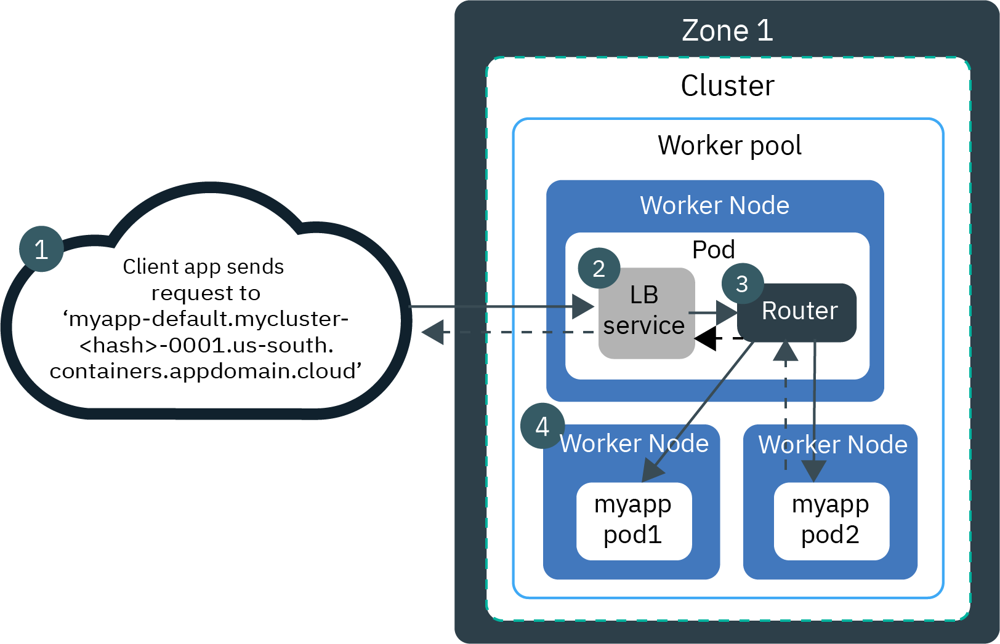
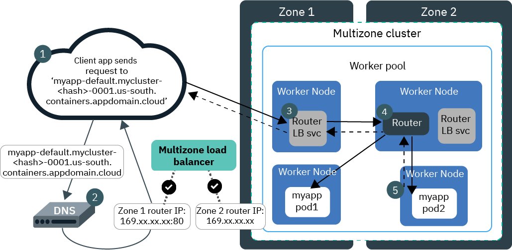
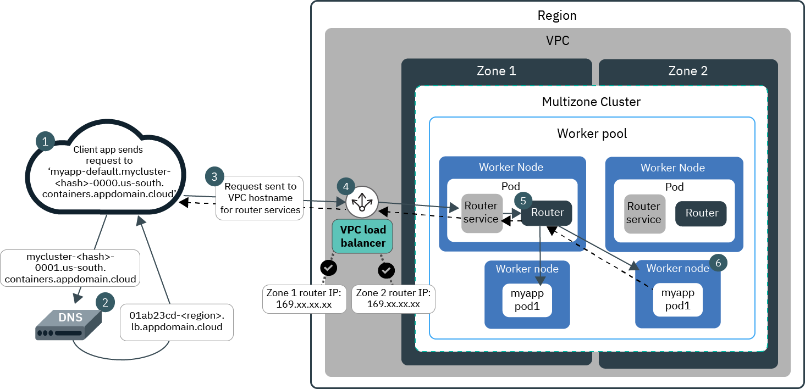
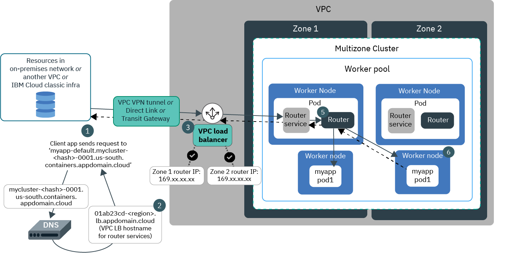

---

copyright:
  years: 2014, 2021
lastupdated: "2021-06-16"

keywords: openshift, roks, rhoks, rhos, route, router

subcollection: openshift

---

{:DomainName: data-hd-keyref="APPDomain"}
{:DomainName: data-hd-keyref="DomainName"}
{:android: data-hd-operatingsystem="android"}
{:api: .ph data-hd-interface='api'}
{:apikey: data-credential-placeholder='apikey'}
{:app_key: data-hd-keyref="app_key"}
{:app_name: data-hd-keyref="app_name"}
{:app_secret: data-hd-keyref="app_secret"}
{:app_url: data-hd-keyref="app_url"}
{:authenticated-content: .authenticated-content}
{:beta: .beta}
{:c#: data-hd-programlang="c#"}
{:cli: .ph data-hd-interface='cli'}
{:codeblock: .codeblock}
{:curl: .ph data-hd-programlang='curl'}
{:deprecated: .deprecated}
{:dotnet-standard: .ph data-hd-programlang='dotnet-standard'}
{:download: .download}
{:external: target="_blank" .external}
{:faq: data-hd-content-type='faq'}
{:fuzzybunny: .ph data-hd-programlang='fuzzybunny'}
{:generic: data-hd-operatingsystem="generic"}
{:generic: data-hd-programlang="generic"}
{:gif: data-image-type='gif'}
{:go: .ph data-hd-programlang='go'}
{:help: data-hd-content-type='help'}
{:hide-dashboard: .hide-dashboard}
{:hide-in-docs: .hide-in-docs}
{:important: .important}
{:ios: data-hd-operatingsystem="ios"}
{:java: .ph data-hd-programlang='java'}
{:java: data-hd-programlang="java"}
{:javascript: .ph data-hd-programlang='javascript'}
{:javascript: data-hd-programlang="javascript"}
{:new_window: target="_blank"}
{:note .note}
{:note: .note}
{:objectc data-hd-programlang="objectc"}
{:org_name: data-hd-keyref="org_name"}
{:php: data-hd-programlang="php"}
{:pre: .pre}
{:preview: .preview}
{:python: .ph data-hd-programlang='python'}
{:python: data-hd-programlang="python"}
{:route: data-hd-keyref="route"}
{:row-headers: .row-headers}
{:ruby: .ph data-hd-programlang='ruby'}
{:ruby: data-hd-programlang="ruby"}
{:runtime: architecture="runtime"}
{:runtimeIcon: .runtimeIcon}
{:runtimeIconList: .runtimeIconList}
{:runtimeLink: .runtimeLink}
{:runtimeTitle: .runtimeTitle}
{:screen: .screen}
{:script: data-hd-video='script'}
{:service: architecture="service"}
{:service_instance_name: data-hd-keyref="service_instance_name"}
{:service_name: data-hd-keyref="service_name"}
{:shortdesc: .shortdesc}
{:space_name: data-hd-keyref="space_name"}
{:step: data-tutorial-type='step'}
{:subsection: outputclass="subsection"}
{:support: data-reuse='support'}
{:swift: .ph data-hd-programlang='swift'}
{:swift: data-hd-programlang="swift"}
{:table: .aria-labeledby="caption"}
{:term: .term}
{:terraform: .ph data-hd-interface='terraform'}
{:tip: .tip}
{:tooling-url: data-tooling-url-placeholder='tooling-url'}
{:troubleshoot: data-hd-content-type='troubleshoot'}
{:tsCauses: .tsCauses}
{:tsResolve: .tsResolve}
{:tsSymptoms: .tsSymptoms}
{:tutorial: data-hd-content-type='tutorial'}
{:ui: .ph data-hd-interface='ui'}
{:unity: .ph data-hd-programlang='unity'}
{:url: data-credential-placeholder='url'}
{:user_ID: data-hd-keyref="user_ID"}
{:vbnet: .ph data-hd-programlang='vb.net'}
{:video: .video}
  


# Exposing apps with routes in {{site.data.keyword.openshiftshort}} 4
{: #openshift_routes}
{: help}
{: support}

Expose the services in your {{site.data.keyword.openshiftlong}} cluster on the router's external IP address by using a route.
{: shortdesc}

 This information is for clusters that run {{site.data.keyword.openshiftshort}} version 4. To set up routes for {{site.data.keyword.openshiftshort}} version 3.11, see [Exposing apps with routes in {{site.data.keyword.openshiftshort}} 3.11](/docs/openshift?topic=openshift-routes-311).
{: important}

Not sure whether to use {{site.data.keyword.openshiftshort}} routes or Ingress? Check out [Choosing among load balancing solutions](/docs/openshift?topic=openshift-cs_network_planning#routes-vs-ingress).
{: tip}

## Overview
{: #routes-overview}

By default, an {{site.data.keyword.openshiftshort}} router is deployed to your cluster that functions as the ingress endpoint for external network traffic.
{: shortdesc}

You can use the OpenShift router to create routes for your apps. Routes are assigned a publicly or privately accessible hostname from the router subdomain that external clients can use to send requests to your app. You can choose to create unsecured or secured routes by using the TLS certificate of the router to secure your hostname. When external request reach your hostname, the router proxies your request and forwards it to the private IP address that your app listens on.

The type of router that is created by default varies depending on your cluster's infrastructure provider and your service endpoint setup.
*  **Classic clusters /  VPC clusters with public cloud service endpoint**: Your cluster is created with a public router by default. The router assigns publicly accessible routes for your apps and listens for requests to your apps on the public host network interface. When a request is received, the router directs the request to the private IP address that the app listens on. If you want to privately expose your apps instead, you must first create a private router, and then create private routes.
*  **VPC clusters with private cloud service endpoint only**: Your cluster is created with a private router by default. The router assigns privately accessible routes for your apps and listens on the private host network interface. Only clients that are connected to your private VPC network can access apps that are exposed by a private route. If you want to publicly expose your apps instead, you must first create a public router, and then create public routes.

If you have a multizone cluster, one high-availability router is deployed to your cluster, and one router service is created in each zone. Two worker nodes are required per zone so that the two replicas of the router can be deployed and updated correctly. Note that the router service in the first zone where you have workers nodes is always named `router-default`, and router services in zones that you subsequently add to your cluster have names such as `router-dal12`.
* To see the router services in each zone of your cluster, run `oc get svc -n openshift-ingress`.
* To see the router subdomain for your cluster and the IP addresses for the router service in each zone, run `ibmcloud oc nlb-dns ls -c <cluster_name_or_ID>` and look for the subdomain formatted like `<cluster_name>-<random_hash>-0000.<region>.containers.appdomain.cloud`.

In your VPC infrastructure dashboard, the VPC load balancer reports as healthy only the two worker nodes that run the router replica pods, because these worker nodes are configured as the listeners for the VPC load balancer. Even though only the listener worker nodes are reported as healthy, the listeners' backend pool of worker nodes is kept up-to-date by {{site.data.keyword.openshiftlong_notm}} so that all worker nodes in your cluster can still receive requests from the VPC load balancer.
{: note}

### Traffic flow in a classic single-zone cluster
{: #route_single}

 The following diagram shows how a router directs network traffic from the internet to an app in a single-zone, classic cluster.
{: shortdesc}



1. A request to your app uses the route hostname that you set up for your app.

2. A DNS service resolves the subdomain to the portable public IP address of router service.

3. The router receives the request, and forwards it to the private IP address of the app pod over the private network. The source IP address of the request package is changed to the public IP address of the worker node where the router pod runs. If multiple app instances are deployed in the cluster, the router sends the requests between the app pods.

4. When the app returns a response packet, it uses the IP address of the worker node where the router that forwarded the client request exists. The router then sends the response packet through the load balancer service to the client.

### Traffic flow in a classic multizone cluster
{: #route_multi}

 The following diagram shows how a router directs network traffic from the internet to an app in a multizone, classic cluster.
{: shortdesc}



1. A request to your app uses the route hostname that you set up for your app.

2. A DNS service resolves the route subdomain to the portable public IP address of a router service that was reported as healthy by the multizone load balancer (MZLB). The MZLB continuously checks the portable public IP addresses of the services that expose the router in each zone in your cluster. Requests are handled by the router services in various zones in a round-robin cycle.

3. Based on the resolved IP address of the router service, the router receives the request.

4. The router forwards the request to the private IP address of the app pod over the private network. The source IP address of the request package is changed to the public IP address of the worker node where the router pod runs. Each router sends requests to the app instances in its own zone and to app instances in other zones. Additionally, if multiple app instances are deployed in one zone, the router alternates requests between app pods.

5. When the app returns a response packet, it uses the IP address of the worker node where the router that forwarded the client request exists. The router then sends the response packet through the load balancer service to the client.

### Traffic flow in a multizone VPC cluster with a public cloud service endpoint
{: #route_vpc}

 When you create a multizone VPC cluster with the public cloud service endpoint enabled, a public router is created by default. The router assigns publicly accessible routes for your apps and listens for requests to your apps on the public host network interface.
{: shortdesc}

The following diagram shows how a router directs network traffic from the internet to an app in a multizone, VPC cluster.



1. A request to your app uses the route hostname that you set up for your app.

2. A DNS service resolves the route subdomain to the VPC load balancer hostname that is assigned to the services for the router. In VPC clusters, your router services' external IP addresses are floating, and are kept behind a VPC-assigned hostname.

3. The VPC load balancer resolves the VPC hostname to an available external IP address of a router service that was reported as healthy. The VPC load balancer continuously checks the external IP addresses of the services that expose the router in each zone in your cluster.

4. Based on the resolved IP address, the VPC load balancer sends the request to a router service.

5. The router forwards the request to the private IP address of the app pod over the private network. The source IP address of the request packet is changed to the IP address of the worker node where the router pod runs. Each router sends requests to the app instances in its own zone and to app instances in other zones. Additionally, if multiple app instances are deployed in one zone, the router alternates requests between app pods.

6. When the app returns a response packet, it uses the IP address of the worker node where the router that forwarded the client request exists. The router then sends the response packet through the VPC load balancer to the client.

### Traffic flow in a multizone VPC cluster with a private cloud service endpoint only
{: #route_vpc_private}

 When you create a multizone VPC cluster with the private cloud service endpoint only, a private router is created by default. The router assigns privately accessible routes for your apps and listens on the private host network interface. Only clients that are connected to your private VPC network can access apps that are exposed by a private route.
{: shortdesc}

The following diagram shows how a router directs network traffic from private networks to an app in a multizone, VPC cluster.



1. A client that is connected to your private VPC network sends a request to your app by using the app's private route. For example, you might use the Virtual Private Cloud VPN, {{site.data.keyword.tg_full_notm}}, or {{site.data.keyword.dl_full_notm}} to allow requests from an on-premises network, another VPC, or {{site.data.keyword.cloud_notm}} classic infrastructure to apps that run in your cluster.

2. A DNS service resolves the route subdomain to the VPC load balancer hostname that is assigned to the services for the router. In VPC clusters, your router services' IP addresses are floating, and are kept behind a VPC-assigned hostname. Note that though the DNS record for the route subdomain is registered in the public DNS system, the DNS resolution servers are reachable from the VPC.

3. The private VPC load balancer resolves the VPC hostname to an available private IP address of a router service that was reported as healthy. The VPC load balancer continuously checks the IP addresses of the services that expose the router in each zone in your cluster.

4. Based on the resolved IP address, the VPC load balancer sends the request to a router service.

5. The router forwards the request to the private IP address of the app pod over the private network. The source IP address of the request packet is changed to the IP address of the worker node where the router pod runs. Each router sends requests to the app instances in its own zone and to app instances in other zones. Additionally, if multiple app instances are deployed in one zone, the router alternates requests between app pods.

6. When the app returns a response packet, it uses the IP address of the worker node where the router that forwarded the client request exists. The router then sends the response packet through the VPC load balancer and through the {{site.data.keyword.vpc_short}} VPN, {{site.data.keyword.tg_short}}, or {{site.data.keyword.dl_short}} to the client.

<br />

## Route types and TLS termination
{: #route-types}

{{site.data.keyword.openshiftshort}} offers four types of routes based on the type of TLS termination that your app requires. Each route type is supported for public and private routes.
{: shortdesc}

| Route type | Use case |
| ---------- | -------- |
| Simple | If you do not need TLS encryption, create a simple route to handle non-encrypted HTTP traffic. |
| Passthrough | When you want TLS connections to pass uninterruptedly from the client to your app pod, create a passthrough route. The router is not involved in TLS termination for encrypted HTTPS traffic, so the app pod must terminate the TLS connection. This type can also be used for HTTP/2 and for non-HTTP TLS endpoints. |
| Edge | When your app pod is exposed on a non-encrypted HTTP endpoint, but you must handle encrypted HTTPS traffic, create an edge route. The TLS connection between the client and the router service is terminated, and the connection between the router service and your app pod is unencrypted. For more information, see the [{{site.data.keyword.openshiftshort}} edge route documentation](https://docs.openshift.com/container-platform/4.6/networking/routes/secured-routes.html#nw-ingress-creating-an-edge-route-with-a-custom-certificate_secured-routes){: external}. |
| Re-encrypt | When your app pod is exposed on an encrypted HTTPS endpoint and you must handle HTTPS traffic, create a re-encrypt route. The TLS connection between the client and the router service is terminated, and a new TLS connection between the router service and your app pod is created. For more information, see the [{{site.data.keyword.openshiftshort}} re-encrypt route documentation](https://docs.openshift.com/container-platform/4.6/networking/routes/secured-routes.html#nw-ingress-creating-a-reencrypt-route-with-a-custom-certificate_secured-routes){: external}. |
{: caption="Types of routes based on TLS termination"}

If you do not need to use a custom domain, you can use an IBM-provided route hostname in the format `<service_name>-<project>.<cluster_name>-<random_hash>-0000.<region>.containers.appdomain.cloud`.

<br />

## Router health checks
{: #health-checks}

Allow access through network policies or other firewall rules so that your router services are reachable by the router health check.
{: shortdesc}

**Classic**: If you use Calico pre-DNAT network policies or another custom firewall to block incoming traffic to your cluster, you must allow inbound access on port 80 from the {{site.data.keyword.openshiftshort}} control plane and Cloudflare's IPv4 IP addresses to the IP addresses of your router services so that the {{site.data.keyword.openshiftshort}} control plane can check the health of your routers. For example, if you use Calico policies, [create a Calico pre-DNAT policy](/docs/openshift?topic=openshift-network_policies#isolate_workers) to allow inbound access to your routers from [Cloudflare's IPv4 IP addresses](https://www.cloudflare.com/ips/){: external} that are used to check the health of your routers on port 80 and [the IP addresses in step 7 of the Updating IAM firewalls section](/docs/openshift?topic=openshift-firewall#iam_allowlist). Continue to the next step to get the router service IP addresses.

**VPC**: If you set up [VPC security groups](/docs/openshift?topic=openshift-vpc-network-policy#security_groups) or [VPC access control lists (ACLs)](/docs/openshift?topic=openshift-vpc-network-policy#acls) to secure your cluster network, ensure that you create the rules to allow the necessary traffic from the {{site.data.keyword.openshiftshort}} control plane IP addresses and Cloudflare IPv4 IP addresses. Alternatively, to allow the inbound traffic for router healthchecks, you can create one rule to allow all incoming traffic on port 80.

On 05 July 2021, the DNS provider is changed from Cloudflare to Akamai for all `containers.appdomain.cloud`, `containers.mybluemix.net`, and `containers.cloud.ibm.com` domains for all clusters in {{site.data.keyword.openshiftlong_notm}}. If you currently allow inbound traffic from the Cloudflare source IP addresses, you must also allow inbound traffic from the [Akamai source IP addresses](https://github.com/IBM-Cloud/kube-samples/tree/master/akamai/gtm-liveness-test){: external} before 05 July. After the migration, you can remove the Cloudflare IP address rules. For more information, see the [announcement](https://cloud.ibm.com/notifications?selected=1621697674798){: external}.
{: important}

## Setting up public routes
{: #routes-setup}

Use a public router to expose apps in your cluster.
{: shortdesc}

The method for setting up public routes varies depending on your cluster's infrastructure provider and your service endpoint setup.
* [Setting up public routes in classic clusters or in VPC clusters with a public cloud service endpoint](#routes-public-classic)
* [Setting up public routes in VPC clusters with a private cloud service endpoint only](#routes-public-vpc-privse)

### Setting up public routes in classic clusters or in VPC clusters with a public cloud service endpoint
{: #routes-public-classic}

If your cluster is created on  classic infrastructure, or if your cluster is created on  VPC infrastructure and you enabled the public cloud service endpoint during cluster creation, your cluster is created with a public router by default. You can use this router to create public routes for your app.
{: shortdesc}

1. Create a Kubernetes `ClusterIP` service for your app deployment. The service provides an internal IP address for the app that the router can send traffic to.
  ```
  oc expose deploy <app_deployment_name> --name my-app-svc
  ```
  {: pre}

2. Choose a domain for your app. **Version 4.6 and later**: Note that route URLs must be 130 characters or fewer.
  * **IBM-provided domain**: If you do not need to use a custom domain, a route hostname is generated for you in the format `<service_name>-<project>.<cluster_name>-<random_hash>-0000.<region>.containers.appdomain.cloud`.
  * **Custom domain**: To specify a custom domain, work with your DNS provider or [{{site.data.keyword.cis_full}}](https://cloud.ibm.com/catalog/services/internet-services).
    1. Get the public IP address for the public router service in each zone in the **EXTERNAL-IP** column. Note that the router service in the first zone where you have workers nodes is always named `router-default`, and router services in zones that you subsequently add to your cluster have names such as `router-dal12`.
      ```
      oc get svc -n openshift-ingress
      ```
      {: pre}
    2. Create a custom domain with your DNS provider.
        If you want to use the same subdomain for multiple services in your cluster, you can register a wildcard subdomain, such as `*.example.com`.
        {: tip}
    3. Map your custom domain to the router's public IP address by adding the IP address as an A record.

3. Set up a route that is based on the [type of TLS termination that your app requires](#route-types). If you do not have a custom domain, do not include the `--hostname` flag. A route hostname is generated for you in the format `<service_name>-<project>.<cluster_name>-<random_hash>-0000.<region>.containers.appdomain.cloud`. If you registered a wildcard subdomain, specify a unique subdomain in each route that you create. For example, you might specify `--hostname svc1.example.com` in this route, and `--hostname svc2.example.com` in another route.
    * Simple:
      ```
      oc expose service <app_service_name> [--hostname <subdomain>]
      ```
      {: pre}
    * Passthrough:
      ```
      oc create route passthrough --service <app_service_name> [--hostname <subdomain>]
      ```
      {: pre}
      <p class="tip">Need to handle HTTP/2 connections? After you create the route, run `oc edit route <app_service_name>` and change the route's `targetPort` value to `https`. You can test the route by running `curl -I --http2 https://<route> --insecure`.</p>
    * Edge: If you use a custom domain, include `--hostname`, `--cert`, and `--key` flags, and optionally the `--ca-cert` flag. For more information about the TLS certificate requirements, see the [{{site.data.keyword.openshiftshort}} edge route documentation](https://docs.openshift.com/container-platform/4.6/networking/routes/secured-routes.html#nw-ingress-creating-an-edge-route-with-a-custom-certificate_secured-routes){: external}.
      ```
      oc create route edge --service <app_service_name> [--hostname <subdomain> --cert <tls.crt> --key <tls.key> --ca-cert <ca.crt>]
      ```
      {: pre}
    * Re-encrypt: If you use a custom domain, include `--hostname`, `--cert`, and `--key` flags, and optionally the `--ca-cert` flag. For more information about the TLS certificate requirements, see the [{{site.data.keyword.openshiftshort}} re-encrypt route documentation](https://docs.openshift.com/container-platform/4.6/networking/routes/secured-routes.html#nw-ingress-creating-a-reencrypt-route-with-a-custom-certificate_secured-routes){: external}.
      ```
      oc create route reencrypt --service <app_service_name> --dest-ca-cert <destca.crt> [--hostname <subdomain> --cert <tls.crt> --key <tls.key> --ca-cert <ca.crt>]
      ```
      {: pre}

4. Verify that the route for your app service is created.
  ```
  oc get routes
  ```
  {: pre}

5. Optional: Customize default routing rules with [optional configurations](https://docs.openshift.com/container-platform/4.6/networking/routes/route-configuration.html){: external}. For example, you can use [route-specific HAProxy annotations](https://docs.openshift.com/container-platform/4.6/networking/routes/route-configuration.html#nw-route-specific-annotations_route-configuration){: external}.

### Setting up public routes in VPC clusters with a private cloud service endpoint only
{: #routes-public-vpc-privse}

 If your cluster is created on VPC infrastructure and you enabled only the private cloud service endpoint during cluster creation, your cluster is created with only a private router by default. To publicly expose your apps, you must first create a public Ingress controller and configure the controller with a subdomain. The Ingress controller automatically creates and configures a new public router, which you can use to create public routes for your apps.
{: shortdesc}

Note that even though you create an Ingress controller in the following steps, the Ingress controller is only required to create and configure the necessary router for you. After the router is created, you use the router directly to create routes, and you do not use the Ingress controller.

1. Prepare the domain that you want to use for your router.
  * **Custom domain**: To register a custom domain, work with your Domain Name Service (DNS) provider or [{{site.data.keyword.cloud_notm}} DNS](/docs/dns?topic=dns-getting-started). <p class="tip">If you want to use the same subdomain for multiple services in your cluster, you can register a wildcard subdomain, such as `*.example.com`.</p>
  * **IBM-provided domain**:
    1. List the existing subdomains in your cluster. In the **Subdomain** column of the output, copy the subdomain that has the highest `i00<n>` value.
        ```
        ibmcloud oc nlb-dns ls --cluster <cluster_name_or_id>
        ```
        {: pre}

        In this example output, the `mycluster-a1b2cdef345678g9hi012j3kl4567890-i002.us-south.containers.appdomain.cloud` subdomain has the highest `i00<n>` value of `i002`.
        ```
        Subdomain                                                                               Load Balancer Hostname                        Health Monitor   SSL Cert Status           SSL Cert Secret Name
        mycluster-a1b2cdef345678g9hi012j3kl4567890-i000.us-south.containers.appdomain.cloud     ["1234abcd-us-south.lb.appdomain.cloud"]      None             created                   mycluster-a1b2cdef345678g9hi012j3kl4567890-i000
        mycluster-a1b2cdef345678g9hi012j3kl4567890-i001.us-south.containers.appdomain.cloud     ["5678efgh-us-south.lb.appdomain.cloud"]      None             created                   mycluster-a1b2cdef345678g9hi012j3kl4567890-i001
        mycluster-a1b2cdef345678g9hi012j3kl4567890-i002.us-south.containers.appdomain.cloud     ["9012ijkl-us-south.lb.appdomain.cloud"]      None             created                   mycluster-a1b2cdef345678g9hi012j3kl4567890-i002
        ```
        {: screen}

    2.  In the subdomain that you copied, change the `i00<n>` value in the subdomain to `000<n+1>`. For example, the `mycluster-a1b2cdef345678g9hi012j3kl4567890-i002.us-south.containers.appdomain.cloud` subdomain is changed to `mycluster-a1b2cdef345678g9hi012j3kl4567890-0003.us-south.containers.appdomain.cloud`. The `0` value indicates a public subdomain, and the `n+1` value indicates the next consecutive subdomain that you create in this cluster. You register this subdomain  in later steps.

2. Create a YAML file that configures a public Ingress controller with the domain from step 1.
    ```yaml
    apiVersion: operator.openshift.io/v1
    kind: IngressController
    metadata:
      name: public
      namespace: openshift-ingress-operator
    spec:
      replicas: 2
      domain: <domain>
      endpointPublishingStrategy:
        loadBalancer:
          scope: External
        type: LoadBalancerService
    ```
    {: codeblock}

3. Create the Ingress controller in the `openshift-ingress-operator` namespace of your cluster. When you create the Ingress controller, a public router is automatically created and deployed in the `openshift-ingress` namespace based on the Ingress controller settings. Additionally, a router service is created to expose the router.
  ```
  oc create -f public.yaml -n openshift-ingress-operator
  ```
  {: pre}

4. Get the VPC hostname in the **EXTERNAL IP** field of the `router-public` service. In VPC clusters, your router services' external IP addresses are floating, and are instead kept behind a VPC-assigned hostname.
  ```
  oc get svc router-public -n openshift-ingress
  ```
  {: pre}

  Example output:
  ```
  NAME                         TYPE           CLUSTER-IP       EXTERNAL-IP                             PORT(S)                      AGE
  router-public                LoadBalancer   172.21.57.132    1234abcd-us-south.lb.appdomain.cloud    80/TCP,443/TCP,1940/TCP      3m
  ```
  {: screen}

5. Register the service's VPC hostname with the domain that you chose in step 1. This step ensures that your router services' IP addresses, which are kept behind the VPC hostname, are registered with the domain that you chose for the router.
  * **Custom domain**: Work with your DNS provider to add the service's VPC hostname as a CNAME that maps to your custom domain.
  * **IBM-provided domain**: Create a DNS entry for the service's VPC hostname. When you run the following command, the subdomain that you specified in step 2 is automatically generated, and is registered with the router service.
    ```
    ibmcloud oc nlb-dns create vpc-gen2 --cluster <cluster_name_or_ID> --lb-host <router_VPC_hostname> --type public
    ```
    {: pre}

6. Update the project where your app is deployed to use the public router instead of the default private router.
  ```
  oc label namespace <app_project> "router=router-public"
  ```
  {: pre}

7. Create a Kubernetes `ClusterIP` service for your app deployment. The service provides an internal IP address for the app that the router can send traffic to.
  ```
  oc expose deploy <app_deployment_name> --name <app_service_name> -n <app_project>
  ```
  {: pre}

8. Set up a route that is based on the [type of TLS termination that your app requires](#route-types). If you do not include the `--hostname` flag, the route hostname is generated for you in the format `<app_service_name>-<app_project>.<router-subdomain>`.
    * Simple:
      ```
      oc expose service <app_service_name> [--hostname <subdomain>]
      ```
      {: pre}
    * Passthrough:
      ```
      oc create route passthrough --service <app_service_name> [--hostname <subdomain>]
      ```
      {: pre}
      <p class="tip">Need to handle HTTP/2 connections? After you create the route, run `oc edit route <app_service_name>` and change the route's `targetPort` value to `https`. You can test the route by running `curl -I --http2 https://<route> --insecure`.</p>
    * Edge: If you use a custom domain, include `--hostname`, `--cert`, and `--key` flags, and optionally the `--ca-cert` flag. For more information about the TLS certificate requirements, see the [{{site.data.keyword.openshiftshort}} edge route documentation](https://docs.openshift.com/container-platform/4.6/networking/routes/secured-routes.html#nw-ingress-creating-an-edge-route-with-a-custom-certificate_secured-routes){: external}.
      ```
      oc create route edge --service <app_service_name> [--hostname <subdomain> --cert <tls.crt> --key <tls.key> --ca-cert <ca.crt>]
      ```
      {: pre}
    * Re-encrypt: If you use a custom domain, include `--hostname`, `--cert`, and `--key` flags, and optionally the `--ca-cert` flag. For more information about the TLS certificate requirements, see the [{{site.data.keyword.openshiftshort}} re-encrypt route documentation](https://docs.openshift.com/container-platform/4.6/networking/routes/secured-routes.html#nw-ingress-creating-a-reencrypt-route-with-a-custom-certificate_secured-routes){: external}.
      ```
      oc create route reencrypt --service <app_service_name> --dest-ca-cert <destca.crt> [--hostname <subdomain> --cert <tls.crt> --key <tls.key> --ca-cert <ca.crt>]
      ```
      {: pre}

9. Verify that the route for your app is created.
  ```
  oc get routes
  ```
  {: pre}

10. Optional: Customize the public router's routing rules with [optional configurations](https://docs.openshift.com/container-platform/4.6/networking/routes/route-configuration.html){: external}. For example, you can use [route-specific HAProxy annotations](https://docs.openshift.com/container-platform/4.6/networking/routes/route-configuration.html#nw-route-specific-annotations_route-configuration){: external}.

11. To create routes for more apps by using the same subdomain, you can repeat steps 7 - 10 so that the route is generated by the same public router. If you want to create routes for more apps by using a different subdomain, repeat all steps in this section to create a new public router with a different domain.

<br />

## Setting up private routes
{: #private-routes}

Use a private router to expose apps in your cluster on the private network.
{: shortdesc}

The method for setting up private routes varies depending on your cluster's infrastructure provider and your service endpoint setup.
* [Setting up private routes in classic clusters or in VPC clusters with a public cloud service endpoint](#private-routes-setup-43)
* [Setting up private routes in VPC clusters with a private cloud service endpoint only](#routes-private-vpc-privse)

### Setting up private routes in classic clusters or in VPC clusters with a public cloud service endpoint
{: #private-routes-setup-43}

If your cluster is created on  classic infrastructure, or if your cluster is created on  VPC infrastructure and you enabled the public cloud service endpoint during cluster creation, your cluster is created with only a public router by default. To privately expose your apps, you must first create a private Ingress controller and configure the controller with a subdomain. The Ingress controller automatically creates and configures a new private router, which you can use to create private routes for your apps.
{: shortdesc}

Note that even though you create an Ingress controller in the following steps, the Ingress controller is only required to create and configure the necessary router for you. After the router is created, you use the router directly to create routes, and you do not use the Ingress controller.

1. Prepare the domain that you want to use for your router.
  * **Custom domain, classic or VPC clusters**: To register a custom domain, work with your Domain Name Service (DNS) provider or [{{site.data.keyword.cloud_notm}} DNS](/docs/dns?topic=dns-getting-started). <p class="tip">If you want to use the same subdomain for multiple services in your cluster, you can register a wildcard subdomain, such as `*.example.com`.</p>
  * **IBM-provided domain, VPC clusters only**:
    1. List the existing subdomains in your cluster. In the **Subdomain** column of the output, copy the subdomain that has the highest `000<n>` value.
        ```
        ibmcloud oc nlb-dns ls --cluster <cluster_name_or_id>
        ```
        {: pre}

        In this example output, the `mycluster-a1b2cdef345678g9hi012j3kl4567890-0002.us-south.containers.appdomain.cloud` subdomain has the highest `000<n>` value of `0002`.
        ```
        Subdomain                                                                               Load Balancer Hostname                        Health Monitor   SSL Cert Status           SSL Cert Secret Name
        mycluster-a1b2cdef345678g9hi012j3kl4567890-0000.us-south.containers.appdomain.cloud     ["1234abcd-us-south.lb.appdomain.cloud"]      None             created                   mycluster-a1b2cdef345678g9hi012j3kl4567890-0000
        mycluster-a1b2cdef345678g9hi012j3kl4567890-0001.us-south.containers.appdomain.cloud     ["5678efgh-us-south.lb.appdomain.cloud"]      None             created                   mycluster-a1b2cdef345678g9hi012j3kl4567890-0001
        mycluster-a1b2cdef345678g9hi012j3kl4567890-0002.us-south.containers.appdomain.cloud     ["9012ijkl-us-south.lb.appdomain.cloud"]      None             created                   mycluster-a1b2cdef345678g9hi012j3kl4567890-0002
        ```
        {: screen}

    2.  In the subdomain that you copied, change the `000<n>` value in the subdomain to `i00<n+1>`. For example, the `mycluster-a1b2cdef345678g9hi012j3kl4567890-0002.us-south.containers.appdomain.cloud` subdomain is changed to `mycluster-a1b2cdef345678g9hi012j3kl4567890-i003.us-south.containers.appdomain.cloud`. The `i` value indicates a private subdomain, and the `n+1` value indicates the next consecutive subdomain that you create in this cluster. You register this subdomain  in later steps.

2.  Create a configuration file that configures a private Ingress controller with the domain from step 1.
    ```yaml
    apiVersion: operator.openshift.io/v1
    kind: IngressController
    metadata:
      name: private
      namespace: openshift-ingress-operator
    spec:
      replicas: 2
      domain: <domain>
      endpointPublishingStrategy:
        loadBalancer:
          scope: Internal
        type: LoadBalancerService
    ```
    {: codeblock}

3. Create the Ingress controller in the `openshift-ingress-operator` namespace of your cluster. When you create the Ingress controller, a private router is automatically created and deployed in the `openshift-ingress` namespace based on the Ingress controller settings. Additionally, a router service is created to expose the router with an IP address (classic clusters) or a VPC hostname (VPC clusters).
  ```
  oc create -f private.yaml -n openshift-ingress-operator
  ```
  {: pre}

4. Get the IP address or VPC hostname in the **EXTERNAL IP** field of the `router-private` service.
  ```
  oc get svc router-private -n openshift-ingress
  ```
  {: pre}

  Example output for classic clusters:
  ```
  NAME                         TYPE           CLUSTER-IP       EXTERNAL-IP    PORT(S)                      AGE
  router-private               LoadBalancer   172.21.57.132    10.XX.XX.XX    80/TCP,443/TCP,1940/TCP      3m
  ```
  {: screen}

  Example output for VPC clusters:
  ```
  NAME                         TYPE           CLUSTER-IP       EXTERNAL-IP                             PORT(S)                      AGE
  router-private               LoadBalancer   172.21.57.132    1234abcd-us-south.lb.appdomain.cloud    80/TCP,443/TCP,1940/TCP      3m
  ```
  {: screen}

5. Register the service's external IP address or VPC hostname with the domain that you chose in step 1.
  * **Custom domain, classic or VPC clusters**: Work with your DNS provider to add the service's external IP address as an A record (classic clusters) or VPC hostname as a CNAME (VPC clusters) that maps to your custom domain.
  * **IBM-provided domain, VPC clusters only**: Create a DNS entry for the service's VPC hostname. When you run the following command, the subdomain that you specified in step 2 is automatically generated, and is registered with the router service.
    ```
    ibmcloud oc nlb-dns create vpc-gen2 --cluster <cluster_name_or_ID> --lb-host <router_VPC_hostname> --type private
    ```
    {: pre}

6. Update the project where your app is deployed to use the private router instead of the default public router.
  ```
  oc label namespace <app_project> "router=router-private"
  ```
  {: pre}

7. Create a Kubernetes `ClusterIP` service for your app deployment. The service provides an internal IP address for the app that the router can send traffic to.
  ```
  oc expose deploy <app_deployment_name> --name <app_service_name> -n <app_project>
  ```
  {: pre}

8. Set up a route that is based on the [type of TLS termination that your app requires](#route-types). Specify the hostname that you set up in step 5.
    * Simple:
      ```
      oc expose service <app_service_name> --hostname <subdomain>
      ```
      {: pre}
    * Passthrough:
      ```
      oc create route passthrough --service <app_service_name> --hostname <subdomain>
      ```
      {: pre}
      <p class="tip">Need to handle HTTP/2 connections? After you create the route, run `oc edit route <app_service_name>` and change the route's `targetPort` value to `https`. You can test the route by running `curl -I --http2 https://<route> --insecure`.</p>
    * Edge: If you use a custom domain, include the `--cert` and `--key` flags, and optionally the `--ca-cert` flag. For more information about the TLS certificate requirements, see the [{{site.data.keyword.openshiftshort}} edge route documentation](https://docs.openshift.com/container-platform/4.6/networking/routes/secured-routes.html#nw-ingress-creating-an-edge-route-with-a-custom-certificate_secured-routes){: external}.
      ```
      oc create route edge --service <app_service_name> --hostname <subdomain> [--cert <tls.crt> --key <tls.key> --ca-cert <ca.crt>]
      ```
      {: pre}
    * Re-encrypt: If you use a custom domain, include the `--cert` and `--key` flags, and optionally the `--ca-cert` flag. For more information about the TLS certificate requirements, see the [{{site.data.keyword.openshiftshort}} re-encrypt route documentation](https://docs.openshift.com/container-platform/4.6/networking/routes/secured-routes.html#nw-ingress-creating-a-reencrypt-route-with-a-custom-certificate_secured-routes){: external}.
      ```
      oc create route reencrypt --service <app_service_name> --dest-ca-cert <destca.crt> --hostname <subdomain> [--cert <tls.crt> --key <tls.key> --ca-cert <ca.crt>]
      ```
      {: pre}

9. Verify that the route for your app is created.
  ```
  oc get routes
  ```
  {: pre}

10. Optional: Customize the private router's routing rules with [optional configurations](https://docs.openshift.com/container-platform/4.6/networking/routes/route-configuration.html){: external}. For example, you can use [route-specific HAProxy annotations](https://docs.openshift.com/container-platform/4.6/networking/routes/route-configuration.html#nw-route-specific-annotations_route-configuration){: external}.

11. To create routes for more apps by using the same subdomain, you can repeat steps 7 - 10 so that the route is generated by the same private router. If you want to create routes for more apps by using a different subdomain, repeat all steps in this section to create a new private router.


### Setting up private routes in VPC clusters with a private cloud service endpoint only
{: #routes-private-vpc-privse}

 If your cluster is created on VPC infrastructure and you enabled the only private cloud service endpoint during cluster creation, your cluster is created with a private router by default. You can use this router to create private routes for your app.
{: shortdesc}

1. Create a Kubernetes `ClusterIP` service for your app deployment. The service provides an internal IP address for the app that the router can send traffic to.
  ```
  oc expose deploy <app_deployment_name> --name my-app-svc
  ```
  {: pre}

2. Choose a domain for your app.
  * **IBM-provided domain**: If you do not need to use a custom domain, a route subdomain is generated for you in the format `<service_name>-<project>.<cluster_name>-<random_hash>-i000.<region>.containers.appdomain.cloud`.
  * **Custom domain**: To specify a custom domain, work with your DNS provider or [{{site.data.keyword.cis_full}}](https://cloud.ibm.com/catalog/services/internet-services).
    1. Get the external IP address for the private router service in each zone in the **EXTERNAL-IP** column. Note that the router service in the first zone where you have workers nodes is always named `router-default`, and router services in zones that you subsequently add to your cluster have names such as `router-dal12`.
      ```
      oc get svc -n openshift-ingress
      ```
      {: pre}
    2. Create a custom domain with your DNS provider.
        If you want to use the same subdomain for multiple services in your cluster, you can register a wildcard subdomain, such as `*.example.com`.
        {: tip}
    3. Map your custom domain to the router services' private IP address by adding the IP addresses as A records.

3. Set up a route that is based on the [type of TLS termination that your app requires](#route-types). If you do not have a custom domain, do not include the `--hostname` flag. A route subdomain is generated for you in the format `<service_name>-<project>.<cluster_name>-<random_hash>-0000.<region>.containers.appdomain.cloud`. If you registered a wildcard subdomain, specify a unique subdomain in each route that you create. For example, you might specify `--hostname svc1.example.com` in this route, and `--hostname svc2.example.com` in another route.
    * Simple:
      ```
      oc expose service <app_service_name> [--hostname <subdomain>]
      ```
      {: pre}
    * Passthrough:
      ```
      oc create route passthrough --service <app_service_name> [--hostname <subdomain>]
      ```
      {: pre}
      <p class="tip">Need to handle HTTP/2 connections? After you create the route, run `oc edit route <app_service_name>` and change the route's `targetPort` value to `https`. You can test the route by running `curl -I --http2 https://<route> --insecure`.</p>
    * Edge: If you use a custom domain, include `--hostname`, `--cert`, and `--key` flags, and optionally the `--ca-cert` flag. For more information about the TLS certificate requirements, see the [{{site.data.keyword.openshiftshort}} edge route documentation](https://docs.openshift.com/container-platform/4.6/networking/routes/secured-routes.html#nw-ingress-creating-an-edge-route-with-a-custom-certificate_secured-routes){: external}.
      ```
      oc create route edge --service <app_service_name> [--hostname <subdomain> --cert <tls.crt> --key <tls.key> --ca-cert <ca.crt>]
      ```
      {: pre}
    * Re-encrypt: If you use a custom domain, include `--hostname`, `--cert`, and `--key` flags, and optionally the `--ca-cert` flag. For more information about the TLS certificate requirements, see the [{{site.data.keyword.openshiftshort}} re-encrypt route documentation](https://docs.openshift.com/container-platform/4.6/networking/routes/secured-routes.html#nw-ingress-creating-a-reencrypt-route-with-a-custom-certificate_secured-routes){: external}.
      ```
      oc create route reencrypt --service <app_service_name> --dest-ca-cert <destca.crt> [--hostname <subdomain> --cert <tls.crt> --key <tls.key> --ca-cert <ca.crt>]
      ```
      {: pre}

4. Verify that the route for your app service is created.
  ```
  oc get routes
  ```
  {: pre}

5. Optional: Customize default routing rules with [optional configurations](https://docs.openshift.com/container-platform/4.6/networking/routes/route-configuration.html){: external}. For example, you can use [route-specific HAProxy annotations](https://docs.openshift.com/container-platform/4.6/networking/routes/route-configuration.html#nw-route-specific-annotations_route-configuration){: external}.

<br />

## Moving router services across VLANs in classic clusters
{: #migrate-router-vlan}

 When you [change your worker node VLAN connections](/docs/openshift?topic=openshift-cs_network_cluster#change-vlans), the worker nodes are connected to the new VLAN and assigned new public or private IP addresses. However, router services cannot automatically migrate to the new VLAN because they are assigned a stable, portable public or private IP address from a subnet that belongs to the old VLAN. When your worker nodes and routers are connected to different VLANs, the routers cannot forward incoming network traffic to app pods on your worker nodes. To move your router services to a different VLAN, you must create the router service on the new VLAN and delete the router service on the old VLAN.
{: shortdesc}

1. Create a router service on the new VLAN.
    1. Create a YAML configuration file for a new router service. Specify the zone that the router service deploys to. Save the file as `router-new-<zone>.yaml`.
        * Public router service:
          ```yaml
          apiVersion: v1
          kind: Service
          metadata:
            annotations:
              service.kubernetes.io/ibm-load-balancer-cloud-provider-zone: <zone>
              service.kubernetes.io/ibm-load-balancer-cloud-provider-ip-type: public
            finalizers:
            - service.kubernetes.io/load-balancer-cleanup
            labels:
              app: router
              ingresscontroller.operator.openshift.io/deployment-ingresscontroller: default
              router: router-default
            name: router-new-<zone>
            namespace: openshift-ingress
          spec:
            externalTrafficPolicy: Local
            ports:
            - name: http
              port: 80
              protocol: TCP
              targetPort: http
            - name: https
              port: 443
              protocol: TCP
              targetPort: https
            selector:
              ingresscontroller.operator.openshift.io/deployment-ingresscontroller: default
            sessionAffinity: None
            type: LoadBalancer
          ```
          {: codeblock}
        * Private router service:
          ```yaml
          apiVersion: v1
          kind: Service
          metadata:
            annotations:
              service.kubernetes.io/ibm-load-balancer-cloud-provider-zone: <zone>
              service.kubernetes.io/ibm-load-balancer-cloud-provider-ip-type: private
            finalizers:
            - service.kubernetes.io/load-balancer-cleanup
            labels:
              app: router
              ingresscontroller.operator.openshift.io/deployment-ingresscontroller: private
              router: router-private
            name: router-new-<zone>
            namespace: openshift-ingress
          spec:
            externalTrafficPolicy: Local
            ports:
            - name: http
              port: 80
              protocol: TCP
              targetPort: http
            - name: https
              port: 443
              protocol: TCP
              targetPort: https
            selector:
              ingresscontroller.operator.openshift.io/deployment-ingresscontroller: private
            sessionAffinity: None
            type: LoadBalancer
          ```
          {: codeblock}

    2. Create the new router service.
      ```
      oc apply -f router-new-<zone>.yaml -n openshift-ingress
      ```
      {: pre}

    3. Get the **EXTERNAL-IP** address of the new router service. This IP address is from a subnet on the new VLAN.
      ```
      oc get svc router-new -n openshift-ingress
      ```
      {: pre}

      Example output for a public router service:
      ```
      NAME                         TYPE           CLUSTER-IP       EXTERNAL-IP     PORT(S)                                     AGE
      router-new                   LoadBalancer   172.21.XX.XX     169.XX.XXX.XX   80:31049/TCP,443:30219/TCP                  2m
      ```
      {: screen}

    4. **Multizone clusters**: If you changed the VLANs for worker nodes in multiple zones, repeat these steps to create a router service on the new VLANs in each zone.

2. Note the **Hostname** of the router. In the output, look for the hostname formatted like `<cluster_name>-<random_hash>-0001.<region>.containers.appdomain.cloud`.
  ```
  ibmcloud oc nlb-dns ls -c <cluster_name_or_ID>
  ```
  {: pre}

  Example output:
  ```
  Hostname                                                                             IP(s)           Health Monitor   SSL Cert Status   SSL Cert Secret Name                            Secret Namespace
  mycluster-35366fb2d3d90fd50548180f69e7d12a-0001.us-east.containers.appdomain.cloud   169.XX.XXX.XX   None             created           roks-ga-35366fb2d3d90fd50548180f69e7d12a-0001   default
  ...
  ```
  {: screen}

3. Add the IP address of the new router service that you found in step 1 to the router's hostname. If you created services for multiple zones in step 1, include each IP address separately in repeated `--ip` flags.
  ```
  ibmcloud oc nlb-dns add -c <cluster_name_or_ID> --ip <new_IP> --nlb-host <subdomain>
  ```
  {: pre}
  Your router service on the new VLAN is now registered with the domain for the default router in your cluster, and can forward incoming requests to apps.

4. Get the IP address of the old router service on the old VLAN. **Multizone clusters**: If you changed the VLANs for worker nodes in multiple zones, get the IP address for the router service in each zone where the VLANs changed. Note that the router service in the first zone where you have workers nodes is always named `router-default`, and router services in the zones that you subsequently add to your cluster have names such as `router-dal12`.
    ```
    oc get svc -n openshift-ingress
    ```
    {: pre}

    Example output for a multizone cluster:
    ```
    NAME                          TYPE           CLUSTER-IP       EXTERNAL-IP      PORT(S)                      AGE
    router-dal12                  LoadBalancer   172.21.190.62    169.XX.XX.XX     80:32318/TCP,443:30915/TCP   51d
    router-default                LoadBalancer   172.21.47.119    169.XX.XX.XX     80:31311/TCP,443:32561/TCP   78d
    router-internal-default       ClusterIP      172.21.51.30     <none>           80/TCP,443/TCP,1936/TCP      78d
    ```
    {: screen}

5. Remove the IP address of the old router service that you found in step 2 from the router's hostname. **Multizone clusters**: Include each IP address separately in repeated `--ip` flags.
  ```
  ibmcloud oc nlb-dns rm classic -c <cluster_name_or_ID> --ip <old_IP> --nlb-host <hostname>
  ```
  {: pre}

6. Verify that the hostname for your router is now registered with the new IP address. After your router hostname is updated with the IP address of the new service, no further changes to your router or routes are required.
  ```
  ibmcloud oc nlb-dns ls -c <cluster_name_or_ID>
  ```
  {: pre}

7. Delete the router service on the old VLAN.
    ```
    oc delete svc <old_router_svc> -n openshift-ingress
    ```
    {: pre}

8. Optional: If you no longer need the subnets on the old VLANs, you can [remove them](/docs/openshift?topic=openshift-subnets#remove-subnets).
