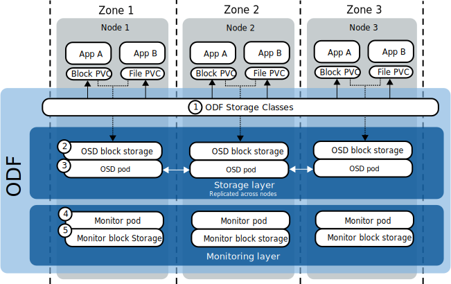
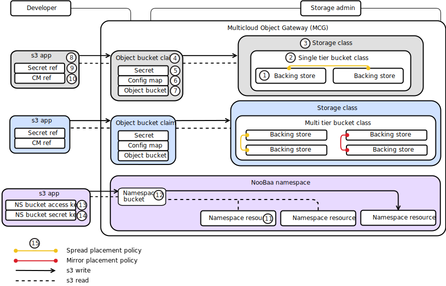

---

copyright:
  years: 2014, 2021
lastupdated: "2021-10-19"

keywords: openshift, openshift data foundation, openshift container storage, vpc, roks, satellite

subcollection: openshift

---

{{site.data.keyword.attribute-definition-list}}

# Understanding OpenShift Data Foundation
{: #ocs-storage-prep}

[OpenShift Data Foundation](https://www.redhat.com/en/technologies/cloud-computing/openshift-data-foundation){: external} is a highly available storage solution that you can use to manage persistent storage for your containerized apps.
{: shortdesc}

Supported infrastructure providers.

- VPC  
- {{site.data.keyword.satelliteshort}}  
- Classic  

What is OpenShift Data Foundation?
:   OpenShift Data Foundation is a highly available storage solution that consists of several open source operators and technologies like [Ceph](https://docs.ceph.com/en/latest/start/intro/){: external}, [NooBaa](https://www.noobaa.io/){: external}, and [Rook](https://rook.io/){: external}. These operators allow you to provision and manage File, Block, and Object storage for your containerized workloads in {{site.data.keyword.openshiftlong}} clusters. Unlike other storage solutions where you might need to configure separate drivers and operators for each type of storage, ODF is a unified solution capable of adapting or scaling to your storage needs. You can also deploy ODF on any OCP cluster.

How does OpenShift Data Foundation work?
:   ODF uses storage volumes in multiples of 3 and replicates your app data across these volumes. The underlying storage volumes that you use for ODF depends on your cluster type. 
    - For VPC clusters the storage volumes are dynamically provisioned {{site.data.keyword.block_storage_is_short}} devices.
    - For bare metal Classic clusters, the storage volumes are local disks on your bare metal worker nodes.
    - For {{site.data.keyword.satelliteshort}} clusters, the storage volumes are either local disks on your worker nodes, or you can dynamically provision disks by using a compatible block storage driver.
:   ODF uses these devices to create a virtualized storage layer, where your app data is replicated for high availability. Because ODF abstracts your underlying storage, you can create use ODF to create File, Block, or Object storage claims all from the same underlying raw block storage.

For a full overview of the features and benefits, see [OpenShift Data Foundation](https://www.redhat.com/en/technologies/cloud-computing/openshift-data-foundation){: external}.

## Architecture overview
{: #odf-ov}

Review the following diagram and table to learn more about OpenShift Data Foundation.
{: shortdesc}

| Number | ODF component | Description |
| --- | --- | --- |
| 1 | OpenShift Data Foundation storage classes | When you deploy ODF, the ODF operator creates File, Block, and Object storage classes in your cluster. Reference these storage classes in your PVCs and to claim storage for your apps. |
| 2 | Object Storage Device (OSD) | These devices provide application storage in your cluster. Each OSD is a raw block storage device that can be a local disk on your worker node or dynamically provisioned when you deploy ODF. In VPC clusters, your OSD block storage devices are dynamically provisioned by using the {{site.data.keyword.block_storage_is_short}} driver. In {{site.data.keyword.satelliteshort}} clusters, you can use local volumes on your worker nodes, or dynamically provision block storage devices by using a block storage driver that supports dynamic provisioning. In Classic clusters, the OSD block devices are local disks on your worker nodes. When you deploy ODF, each device is mounted by an OSD pod. The total storage that is available to your applications is equal to the `osdSize` multiplied by the `numOfOsd`. |
| 3 | Object Storage Daemon (OSD) pods | The OSD pods manage data placement and replication across your storage devices. |
| 4 | Monitor (Mon) pods | The Monitor pods keep a map of your OpenShift Data Foundation storage cluster and monitor storage cluster health. |
| 5 | Monitor (Mon) block storage device | The monitor storage devices are the underlying storage devices for the monitor pods. Each monitor device is a raw block storage device that can be a local disk on your worker node or dynamically provisioned when you deploy ODF. Each device provides storage to a monitor pod. |
{: caption="ODF architecture overview" caption-side="top"}
{: summary="The rows are read from left to right. The first column is the diagram number of ODF resource. The second column is the name of the resource. The third column is a brief description of the resource."}

## Multicloud Object Gateway overview
{: #understanding-noobaa}

The Multicloud Object Gateway consists of the open source tool [NooBaa](https://www.noobaa.io/){: external} and is a component of OpenShift Data Foundation. With the Multicloud Object Gateway, you can manage objects and buckets across cloud providers.
{: shortdesc}

| Number | Multicloud Object Gateway component | Description |
| --- | --- | --- |
| 1 | Backing store | Backing stores are s3 compatible object storage buckets. In the Multicloud Object Gateway, your backing stores can be in any cloud environment, regardless of provider. You can connect several backing stores to the Multicloud Object Gateway. When you deploy ODF, the default backing store uses the raw block storage devices that you specify for your ODF storage cluster. However, you can optionally set up {{site.data.keyword.cos_full_notm}} as your default backing store. |
| 2 | Bucket class | A bucket class consists of one or more backing stores (buckets) and a placement policy. You can configure backing stores and placement policies to manage your objects across locations and clouds. |
| 3 | Namespace resource | A namespace resource is an s3 compatible bucket. After you add namespace resources (buckets) to your Multicloud Object Gateway, you can reference those buckets by creating a Namespace bucket which can be used to read and write from one or more namespace resource.
| 4 | Namespace bucket | A namespace bucket abstracts one or more namespace resources in the NooBaa namespace. When you create a namespace bucket, you can specify read or write policies to the namespace resources that you have configured in your Multicloud Object Gateway. For example, you can read from two buckets across different cloud providers and write to a third bucket in another, separate cloud environment. |
| 5 | Secret ref | A secret ref is a reference to a Kuberentes secret in your cluster. When you create an Object Bucket Claim, NooBaa creates a corresponding secret and config map. Then, you can reference the secret and config map in your apps without needing to directly include the credentials in your apps. |
| 6 | Placement policy | When you create a bucket class, you must specify a placement policy. Placement policies define how your data is written to your backing stores. A **Mirror** placement policy mirrors objects across the backing stores in your bucket class and a **Spread** placement policy distributes the objects across the backing stores in your bucket class.  |
| 7 | Config map ref | A config map ref is a reference to a Kuberentes config map in your cluster. When you create an Object Bucket Claim, NooBaa dynamically creates a corresponding secret and config map. You can reference the secret and config map in your apps without needing to include these credentials in your applications. |
| 8 | Storage class | A storage class in the Multicloud Object Gateway is similar to any other Kuberenetes storage class in that it defines storage resource parameters. However, in the Multicloud Object Gateway, when you create a storage class, you specify the bucket class that you want to use. By creating a storage class from your bucket class, you can make your Multicloud Object Gateway resources available across namespaces. |
| 9 | Object bucket claim (OBC) | An object bucket claim (OBC) is similar to a Kubernetes persistent volume claim (PVC) in that developers or storage admins can create OBCs to claim storage resources. When you create an OBC, you specify the storage class that you want to use and optionally provide a name for the dynamically created object bucket. |
| 10 | Object bucket | An object bucket is a dynamically provisioned when you create an Object bucket claim. The object bucket abstracts one or more backing stores to a single resource. |
| 11 | Namespace bucket access key | The access key is used to access your namespace bucket. Namespace buckets can include multiple namespace resources from different cloud providers or on-prem buckets. The namespace bucket access key and secret key are used in your s3 apps to configure access to your namespace bucket which then defines read and write policies to namespace resources that you configure. |
| 12 | Namespace bucket secret key | The secret key is used to access your namespace bucket. Namespace buckets can include multiple namespace resources from different cloud providers or on-prem buckets. The namespace bucket access key and secret key are used in your s3 apps to configure access to your namespace bucket which then defines read and write policies to namespace resources that you configure. |
{: caption="NooBaa overview" caption-side="top"}
{: summary="The rows are read from left to right. The first column is the diagram number of the resource. The second column is a brief description of the resource."}

## Deploying OpenShift Data Foundation
{: #odf-deploy-options}

Review the deployment options for your infrastructure provider.
{: shortdesc}

Virtual Private Cloud (VPC) clusters
:   You can deploy ODF by using dynamic provisioning with {{site.data.keyword.block_storage_is_short}}. For more information, see [Deploying OpenShift Data Foundation on VPC clusters](/docs/openshift?topic=openshift-deploy-odf-vpc).

{{site.data.keyword.satelliteshort}} clusters
:   You can deploy ODF by using either dynamically provisioned disks or local disks on your worker nodes. If you want to deploy ODF to one cluster only, you can use the managed cluster add-on. If you want to deploy ODF to multiple {{site.data.keyword.satelliteshort}} clusters, you can use the {{site.data.keyword.satelliteshort}} storage template. For more information, see the following links.
    - [Deploying the OpenShift Data Foundation add-on on {{site.data.keyword.satelliteshort}} clusters](/docs/openshift?topic=openshift-deploy-odf-sat).
    - [Deploying the OpenShift Data Foundation template for remote, dynamically provisioned disks](/docs/satellite?topic=satellite-config-storage-ocs-local).
    - [Deploying the OpenShift Data Foundation template for local disks](/docs/satellite?topic=satellite-config-storage-ocs-remote).

Classic clusters
:   You can deploy ODF by using local disks on your bare metal worker nodes. For more information, see [Deploying OpenShift Data Foundation on Classic clusters](/docs/openshift?topic=openshift-deploy-odf-classic).

