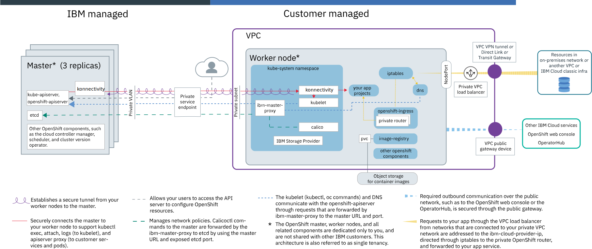

---

copyright:
  years: 2014, 2021
lastupdated: "2021-11-10"

keywords: openshift, compliance, security standards, red hat openshift, openshift container platform, red hat, openshift architecture, red hat architecture, openshift dependencies,

subcollection: openshift

---

{{site.data.keyword.attribute-definition-list}}

# Architecture and dependencies of the service
{: #service-arch}

Review sample architectures, components, and dependencies for your {{site.data.keyword.openshiftlong}} clusters.
{: shortdesc}

## Classic cluster service architecture
{: #service-architecture}

 The following architectural overviews are specific to the classic infrastructure provider. For an architectural overview for the VPC infrastructure provider, see [VPC cluster service architecture](#service-architecture_vpc).
{: note}

In {{site.data.keyword.openshiftlong_notm}}, your clusters comprise an IBM-managed master that secures components such as the API server and etcd, and customer-managed worker nodes that you configure to run you app workloads, as well as {{site.data.keyword.openshiftshort}}-provided default components. The default components within the cluster, such as the {{site.data.keyword.openshiftshort}} web console or OperatorHub, vary with the {{site.data.keyword.openshiftshort}} version of your cluster.
{: shortdesc}

### {{site.data.keyword.openshiftshort}} version 4 architecture
{: #service-architecture-4}

 Review the architecture diagram and then scroll through the following tables for a description of master and worker node components in {{site.data.keyword.openshiftlong_notm}} clusters that run version 4 on classic infrastructure. For more information about the OpenShift Container Platform architecture, see the [{{site.data.keyword.openshiftshort}} docs](https://docs.openshift.com/container-platform/4.7/architecture/architecture.html){: external}.
{: shortdesc}

When you run `oc get nodes`, you might notice that the **ROLES** of your worker nodes are marked as both `master,worker`. These nodes are worker nodes in {{site.data.keyword.cloud_notm}}, and do not include the master components that are managed by IBM. Instead, these nodes are marked as `master` because they run OpenShift Container Platform components that are required to set up and manage default resources within the cluster, such as the OperatorHub and internal registry.
{: note}

#### {{site.data.keyword.openshiftshort}} version 4 master components
{: #service-architecture-4-master}

Review the following components in the IBM-managed master of your {{site.data.keyword.openshiftlong_notm}} cluster.
{: shortdesc}

You cannot modify these components. IBM manages the components and automatically updates them during master patch updates.

In OpenShift Container Platform 4, many components are configured by a corresponding operator for ease of management. The following table discusses these operators and components together, to focus on the main functionality the component provides to the cluster.

| Master components| Description |
|:-----------------|:-----------------|
| Single tenancy | The master and all master components are dedicated only to you, and are not shared with other IBM customers. |
| Replicas | Master components, including the {{site.data.keyword.openshiftshort}} API server and etcd data store have three replicas and, if located in a multizone metro, are spread across zones for even higher availability. The master components are backed up every 8 hours.|
| `cloud-controller-manager` | The cloud controller manager manages cloud provider-specific components such as the {{site.data.keyword.cloud_notm}} load balancer.|
| `cluster-health` | The cluster health component monitors the health of the cluster and integrates with {{site.data.keyword.cloud_notm}} monitoring and metrics for the service.|
|  `cluster-policy-controller` | The [`cluster-policy-controller`](https://github.com/openshift/cluster-policy-controller){: external} maintains policy resources that are required to create pods within the cluster. |
| `cluster-version-operator` | The cluster version operator (CVO) installs and updates other operators that run in the cluster. For more information, see the [GitHub project](https://github.com/openshift/cluster-version-operator){: external}.|
| `control-plane-operator` | The control plane operator manages the installation and update of control plane components in the master.|
| `etcd`, `etcd-molecule`, `etcd-operator` | etcd is a highly available key value store that stores the state of all Kubernetes resources of a cluster, such as services, deployments, and pods. Data in etcd is backed up every 8 hours to an encrypted storage instance that IBM manages.|
| `kube-controller-manager`, `openshift-controller-manager` | The [Kubernetes controller](https://github.com/openshift/cluster-kube-controller-manager-operator){: external} watches the state of objects within the cluster, such as the replica set of a workload. When the state of an object changes, for example if a pod in a replica set goes down, the controller manager initiates correcting actions to achieve the required state.  The {{site.data.keyword.openshiftshort}} controller performs the same function for objects that are specific to the {{site.data.keyword.openshiftshort}} API, such as projects. |
| `kube-scheduler` | The [Kubernetes scheduler](https://github.com/openshift/cluster-kube-scheduler-operator){: external} watches for newly created pods and decides where to deploy them based on capacity, performance needs, policy constraints, anti-affinity specifications, and workload requirements. If no worker node can be found that matches the requirements, the pod is not deployed in the cluster. |
| `manifests-bootstrapper` | The manifests bootstrapper job sets up the master with the required certificates to join as the master node of the cluster. |
| `oauth-openshift` | The built-in OAuth server is automatically set up to integrate with {{site.data.keyword.cloud_notm}} Identity and Access Management (IAM). You cannot add other supported identity providers to the cluster. For more information about how to authenticate with the cluster via IAM, see [Accessing {{site.data.keyword.openshiftshort}} clusters](/docs/openshift?topic=openshift-access_cluster). |
| `openshift-apiserver`, `openshift-apiserver-operator`, `kube-apiserver` | The API server is the main entry point for all cluster management requests from the worker node to the master. The API server validates and processes requests that change the state of Kubernetes objects, such as pods or services, and {{site.data.keyword.openshiftshort}} objects, such as projects or users. Then, the API server stores this state in the etcd data store.|
| `openvpnserver`, `openvpn-operator` | The OpenVPN server works with the OpenVPN client to securely connect the master to the worker node. This connection supports `apiserver proxy` calls to your pods and services; `oc exec`, `attach`, and `logs` calls to the kubelet; and mutating and validating webhooks.|
| Admission controllers | Admission controllers are implemented for specific features in {{site.data.keyword.openshiftlong_notm}} clusters. With admission controllers, you can set up policies in your cluster that determine whether a particular action in the cluster is allowed or not. In the policy, you can specify conditions when a user cannot perform an action, even if this action is part of the general permissions that you assigned the user by using RBAC. Therefore, admission controllers can provide an extra layer of security for your cluster before an API request is processed by the {{site.data.keyword.openshiftshort}} API server.    When you create an {{site.data.keyword.openshiftshort}} cluster, the following [Kubernetes admission controllers](https://kubernetes.io/docs/reference/access-authn-authz/admission-controllers/){: external} are automatically installed in the given order in the {{site.data.keyword.openshiftshort}} master, which cannot be changed by the user:<ul><li><code>NamespaceLifecycle</code></li><li><code>LimitRanger</code></li><li><code>ServiceAccount</code></li><li><code>DefaultStorageClass</code></li><li><code>ResourceQuota</code></li><li><code>StorageObjectInUseProtection</code></li><li><code>PersistentVolumeClaimResize</code></li><li><a href="/docs/openshift?topic=openshift-pod_priority"><code>Priority</code></a></li><li><code>BuildByStrategy</code></li><li><code>OriginPodNodeEnvironment</code></li><li><code>PodNodeSelector</code></li><li><code>ExternalIPRanger</code></li><li><code>NodeRestriction</code></li><li><code>SecurityContextConstraint</code></li><li><code>SCCExecRestrictions</code></li><li><code>PersistentVolumeLabel</code></li><li><code>OwnerReferencesPermissionEnforcement</code></li><li><code>PodTolerationRestriction</code></li><li><code>openshift.io/JenkinsBootstrapper</code></li><li><code>openshift.io/BuildConfigSecretInjector</code></li><li><code>openshift.io/ImageLimitRange</code></li><li><code>openshift.io/RestrictedEndpointsAdmission</code></li><li><code>openshift.io/ImagePolicy</code></li><li><code>openshift.io/IngressAdmission</code></li><li><code>openshift.io/ClusterResourceQuota</code></li><li><code>MutatingAdmissionWebhook</code></li><li><code>ValidatingAdmissionWebhook</code></li></ul> 
You can [install your own admission controllers in the cluster](https://kubernetes.io/docs/reference/access-authn-authz/extensible-admission-controllers/#admission-webhooks){: external} or choose from the optional admission controllers that {{site.data.keyword.openshiftlong_notm}} provides.
<ul><li><strong>Container image security enforcement:</strong> Install <a href="/docs/openshift?topic=openshift-images#portieris-image-sec">Portieris</a> to block container deployments from unsigned images.</li></ul> 
If you manually installed admission controllers and you do not want to use them anymore, make sure to remove them entirely. If admission controllers are not entirely removed, they might block all actions that you want to perform on the cluster.

{: summary="The rows are read from left to right. The first column is the master component. The second column is a description of the component."}
{: caption="{{site.data.keyword.openshiftshort}} 4 master components." caption-side="top"}

#### {{site.data.keyword.openshiftshort}} version 4 worker node components
{: #service-architecture-4-workers}

Review the following components in the customer-managed worker nodes of your {{site.data.keyword.openshiftlong_notm}} cluster.
{: shortdesc}

These components run on your worker nodes because you are able to use them with the workloads that you deploy to your cluster. For example, your apps might use an operator from the OperatorHub that runs a container from an image that is stored in the internal registry. You are responsible for your usage of these components, but IBM provides updates for them in the worker node patch updates that you choose to apply.

In OpenShift Container Platform 4, many components are configured by a corresponding operator for ease of management. The following table discusses these operators and components together, to focus on the main functionality the component provides to the cluster.

| Worker node components| Description |
|:-----------------|:-----------------|
| Single tenancy | The worker nodes and all worker node components are dedicated only to you, and are not shared with other IBM customers. However, if you use worker node virtual machines, the underlying hardware might be shared with other IBM customers depending on the [level of hardware isolation](/docs/openshift?topic=openshift-planning_worker_nodes#vm) that you choose. |
| Operating System | {{site.data.keyword.openshiftlong_notm}} worker nodes run on the Red Hat Enterprise Linux 7 operating system. |
| CRI-O container runtime | Your worker nodes are installed with [CRI-O](https://cri-o.io/){: external} as the container runtime interface. For more information, see [Container runtime](/docs/openshift?topic=openshift-security#container-runtime). |
| Projects | {{site.data.keyword.openshiftshort}} organizes your resources into projects, which are Kubernetes namespaces with annotations, and includes many more components than community Kubernetes clusters to run {{site.data.keyword.openshiftshort}} features such as the catalog. Select components of projects are described in the following rows. For more information, see [Working with projects](http://docs.openshift.com/container-platform/4.7/applications/projects/working-with-projects.html){: external}.|
| `calico-system`, `tigera-operator` | Calico manages network policies for your cluster, and includes a few components to manage container network connectivity, IP address assignment, and network traffic control. The Tigera operator installs and manages the lifecycle of Calico components.|
| `default` | This project is used if you do not specify a project or create a project for your Kubernetes resources.|
| `ibm-system` | This project includes the `ibm-cloud-provider-ip` deployment that works with `keepalived` to provide health checking and Layer 4 load balancing for requests to app pods.|
| `kube-system` | This project includes many components that are used to run Kubernetes on the worker node.<ul><li><strong><code>ibm-master-proxy</code></strong>: The <code>ibm-master-proxy</code> is a daemon set that forwards requests from the worker node to the IP addresses of the highly available master replicas. In single zone clusters, the master has three replicas on separate hosts. For clusters that are in a multizone-capable zone, the master has three replicas that are spread across zones. A highly available load balancer forwards requests to the master domain name to the master replicas.</li><li><strong><code>kubelet</code></strong>: The kubelet is a worker node agent that runs on every worker node and is responsible for monitoring the health of pods that run on the worker node and for watching the events that the API server sends. Based on the events, the kubelet creates or removes pods, ensures liveness and readiness probes, and reports back the status of the pods to the API server.</li><li><strong><code>vpn</code></strong>: The OpenVPN client works with the OpenVPN server to securely connect the master to the worker node. This connection supports <code>apiserver proxy</code> calls to your pods and services, and <code>oc exec</code>, <code>attach</code>, and <code>logs</code> calls to the kubelet.</li><li><strong>Other components</strong>: The <code>kube-system</code> project also includes components to manage IBM-provided resources such as storage plug-ins for file and block storage, ingress application load balancer (ALB), and <code>keepalived</code>.</li></ul>|
| `openshift-cloud-credential-operator` | The cloud credential operator manages a controller for {{site.data.keyword.openshiftshort}} components that request cloud provider credentials. The controller ensures that only the credentials that are required for the operation are used, and not any elevated permissions like `admin`. For more information, see the [GitHub project](https://github.com/openshift/cloud-credential-operator){: external}.|
| `openshift-cluster-node-tuning-operator` | IBM manages the [node tuning operator](https://docs.openshift.com/container-platform/4.7/scalability_and_performance/using-node-tuning-operator.html){: external}, which runs a daemon set on each worker node in the cluster to tune the default worker node settings. You cannot edit the default worker node settings. |
| `openshift-cluster-samples-operator` | The [samples operator](https://docs.openshift.com/container-platform/4.7/openshift_images/configuring-samples-operator.html){: external} manages select image streams and templates that come with the {{site.data.keyword.openshiftshort}} cluster by default. You can deploy these templates from the [**Developer** perspective in the {{site.data.keyword.openshiftshort}} web console](/docs/openshift?topic=openshift-deploy_app#openshift_console). |
| `openshift-cluster-storage-operator` | The cluster storage operator makes sure that a default storage class is set. To review or change the default {{site.data.keyword.cloud_notm}} storage class, see [Changing the default storage class](/docs/openshift?topic=openshift-kube_concepts#default_storageclass). |
| `openshift-console`, `openshift-console-operator` | The {{site.data.keyword.openshiftshort}} web console is a user-friendly, web-based interface that you can use to manage the {{site.data.keyword.openshiftshort}} and Kubernetes resources that run in your cluster. You can also use the console to display an `oc login` token to authenticate to your cluster from a CLI. For more information, see [Navigating the {{site.data.keyword.openshiftshort}} console](/docs/openshift?topic=openshift-openshift_tutorial#openshift_oc_console).|
| `openshift-dns`, `openshift-dns-operator` | The DNS project includes the components to validate incoming network traffic against the `iptables` rules that are set up on the worker node, and proxies requests that are allowed to enter or leave the cluster.|
| `openshift-image-registry` | {{site.data.keyword.openshiftshort}} provides an internal [container image registry](https://docs.openshift.com/container-platform/4.7/registry/architecture-component-imageregistry.html){: external} that you can use to locally manage and view images through the console. Alternatively, you can [set up the private {{site.data.keyword.registrylong_notm}}](/docs/openshift?topic=openshift-registry#openshift_iccr) or [import images from {{site.data.keyword.registrylong_notm}} to the internal registry](/docs/openshift?topic=openshift-registry#imagestream_registry). The internal registry comes with a classic {{site.data.keyword.cloud_notm}} File Storage volume in your IBM Cloud infrastructure account to [store the registry images](/docs/openshift?topic=openshift-registry#openshift_internal_registry). The file storage volume is provisioned through the `image-registry-storage` persistent volume claim (PVC).|
| `openshift-ingress`, `openshift-ingress-operator` | {{site.data.keyword.openshiftshort}} uses [routes](https://docs.openshift.com/container-platform/4.7/networking/routes/route-configuration.html){: external} to directly expose an app's service on a hostname so that external clients can reach the service. To create routes, the cluster uses the Ingress operator.  You can also use [Ingress](/docs/openshift?topic=openshift-ingress-about-roks4) to expose apps externally and customize routing. Ingress consists of three components: the Ingress controller, router, and Ingress resources. The router maps the service to the hostname. By default, the router includes two replicas. Make sure that your cluster has at least two worker nodes so that the router can run on separate compute hosts for higher availability.|
| `openshift-marketplace` | The marketplace includes the [OperatorHub](https://docs.openshift.com/container-platform/4.7/operators/understanding/olm-understanding-operatorhub.html){: external} that comes with the {{site.data.keyword.openshiftshort}} cluster by default. The OperatorHub includes operators from Red Hat and 3rd-party providers. Keep in mind that these operators are provided by the community, might not integrate with your cluster, and are not supported by IBM. You can [enable operators](/docs/openshift?topic=openshift-operators) from the OperatorHub in {{site.data.keyword.openshiftshort}} web console. |
| `openshift-monitoring` | OpenShift Container Platform includes a [built-in monitoring stack](http://docs.openshift.com/container-platform/4.7/monitoring/understanding-the-monitoring-stack.html){: external} for your cluster, that includes metrics and alert managing capabilities. For a comparison of the built-in monitoring stack and other options such as {{site.data.keyword.mon_full_notm}}, see [Understanding options for logging and monitoring](/docs/openshift?topic=openshift-health). |
| `openshift-multus` | OpenShift Container Platform uses the Multus container network interface (CNI) plug-in to allow [multiple pod networks](https://docs.openshift.com/container-platform/4.7/networking/multiple_networks/understanding-multiple-networks.html){: external}. However, you cannot configure the cluster to use multiple pod networks. {{site.data.keyword.openshiftlong_notm}} clusters support only Calico, which is set up for your cluster by default. If enabled, [Service Mesh](https://docs.openshift.com/container-platform/4.7/service_mesh/v1x/servicemesh-release-notes.html){: external} uses the Multus plug-in. |
| `openshift-network-operator` | The [cluster network operator (CNO)](https://docs.openshift.com/container-platform/4.7/networking/cluster-network-operator.html){: external} manages the cluster network components that are set up by default, such as the CNI pod network provider plug-in and DNS operator.|
| `openshift-operator-lifecycle-manager` | The [operator lifecycle manager (OLM)](https://docs.openshift.com/container-platform/4.7/operators/understanding/olm/olm-understanding-olm.html){: external} manages the lifecycle of all operators and the catalog that run in the cluster, including the operators for the default components and any custom operators that you add.|
| `openshift-service-ca`, `openshift-service-ca-operator` | The certificate authority (CA) operator runs certificate signing and injects certificates into API server resources and configmaps in the cluster. For more information, see the [GitHub project](https://github.com/openshift/service-ca-operator){: external}.|
{: summary="The rows are read from left to right. The first column is the worker node component. The second column is a description of the component."}
{: caption="{{site.data.keyword.openshiftshort}} 4 worker node components." caption-side="top"}

### {{site.data.keyword.openshiftshort}} version 3 architecture
{: #service-architecture-3}

 Review the architecture diagram and then scroll through the following table for a description of master and worker node components in {{site.data.keyword.openshiftlong_notm}} clusters that run version 3. For more information about the OpenShift Container Platform architecture, see the [{{site.data.keyword.openshiftshort}} docs](https://docs.openshift.com/container-platform/3.11/architecture/index.html){: external}.
{: shortdesc}

| Master components| Description |
|:-----------------|:-----------------|
| Single tenancy | The master and all master components are dedicated only to you, and are not shared with other IBM customers. |
| Replicas | Master components, including the {{site.data.keyword.openshiftshort}} Kubernetes API server and etcd data store have three replicas and, if located in a multizone metro, are spread across zones for even higher availability. The master components are backed up every 8 hours.|
| `openshift-api` | The {{site.data.keyword.openshiftshort}} Kubernetes API server serves as the main entry point for all cluster management requests from the worker node to the master. The API server validates and processes requests that change the state of Kubernetes resources, such as pods or services, and stores this state in the etcd data store.|
| `openvpn-server` | The OpenVPN server works with the OpenVPN client to securely connect the master to the worker node. This connection supports `apiserver proxy` calls to your pods and services, and `oc exec`, `attach`, and `logs` calls to the kubelet.|
| `etcd` | etcd is a highly available key value store that stores the state of all Kubernetes resources of a cluster, such as services, deployments, and pods. Data in etcd is backed up to an encrypted storage instance that IBM manages.|
| `openshift-controller` | The {{site.data.keyword.openshiftshort}} controller manager watches for newly created pods and decides where to deploy them based on capacity, performance needs, policy constraints, anti-affinity specifications, and workload requirements. If no worker node can be found that matches the requirements, the pod is not deployed in the cluster. The controller also watches the state of cluster resources, such as replica sets. When the state of a resource changes, for example if a pod in a replica set goes down, the controller manager initiates correcting actions to achieve the required state. The `openshift-controller` functions as both the scheduler and controller manager in a community Kubernetes configuration. |
| `cloud-controller-manager` | The cloud controller manager manages cloud provider-specific components such as the {{site.data.keyword.cloud_notm}} load balancer.|
| Admission controllers | Admission controllers are implemented for specific features in {{site.data.keyword.openshiftlong_notm}} clusters. With admission controllers, you can set up policies in your cluster that determine whether a particular action in the cluster is allowed or not. In the policy, you can specify conditions when a user cannot perform an action, even if this action is part of the general permissions that you assigned the user by using RBAC. Therefore, admission controllers can provide an extra layer of security for your cluster before an API request is processed by the API server.    When you create an {{site.data.keyword.openshiftshort}} cluster, the following [Kubernetes admission controllers](https://kubernetes.io/docs/reference/access-authn-authz/admission-controllers/){: external} are automatically installed in the given order in the {{site.data.keyword.openshiftshort}} master, which cannot be changed by the user:<ul><li><code>NamespaceLifecycle</code></li><li><code>LimitRanger</code></li><li><code>ServiceAccount</code></li><li><code>DefaultStorageClass</code></li><li><code>ResourceQuota</code></li><li><code>StorageObjectInUseProtection</code></li><li><code>PersistentVolumeClaimResize</code></li><li><a href="/docs/openshift?topic=openshift-pod_priority"><code>Priority</code></a></li><li><code>BuildByStrategy</code></li><li><code>OriginPodNodeEnvironment</code></li><li><code>PodNodeSelector</code></li><li><code>ExternalIPRanger</code></li><li><code>NodeRestriction</code></li><li><code>SecurityContextConstraint</code></li><li><code>SCCExecRestrictions</code></li><li><code>PersistentVolumeLabel</code></li><li><code>OwnerReferencesPermissionEnforcement</code></li><li><code>PodTolerationRestriction</code></li><li><code>openshift.io/JenkinsBootstrapper</code></li><li><code>openshift.io/BuildConfigSecretInjector</code></li><li><code>openshift.io/ImageLimitRange</code></li><li><code>openshift.io/RestrictedEndpointsAdmission</code></li><li><code>openshift.io/ImagePolicy</code></li><li><code>openshift.io/IngressAdmission</code></li><li><code>openshift.io/ClusterResourceQuota</code></li><li><code>MutatingAdmissionWebhook</code></li><li><code>ValidatingAdmissionWebhook</code></li></ul> 
You can [install your own admission controllers in the cluster](https://kubernetes.io/docs/reference/access-authn-authz/extensible-admission-controllers/#admission-webhooks){: external} or choose from the optional admission controllers that {{site.data.keyword.openshiftlong_notm}} provides.
<ul><li><strong>Container image security enforcement:</strong> Install <a href="/docs/openshift?topic=openshift-images#portieris-image-sec">Portieris</a> to block container deployments from unsigned images.</li></ul> 
If you manually installed admission controllers and you do not want to use them anymore, make sure to remove them entirely. If admission controllers are not entirely removed, they might block all actions that you want to perform on the cluster.

{: caption="{{site.data.keyword.openshiftshort}} 3 master components." caption-side="top"}
{: #roks-components-1}
{: tab-title="Master"}
{: tab-group="roks-components"}
{: class="simple-tab-table"}

| Worker node components| Description |
|:-----------------|:-----------------|
| Single tenancy | The worker nodes and all worker node components are dedicated only to you, and are not shared with other IBM customers. However, if you use worker node virtual machines, the underlying hardware might be shared with other IBM customers depending on the [level of hardware isolation](/docs/openshift?topic=openshift-planning_worker_nodes#vm) that you choose. |
| Operating System | {{site.data.keyword.openshiftlong_notm}} worker nodes run on the Red Hat Enterprise Linux 7 operating system. |
| Projects | {{site.data.keyword.openshiftshort}} organizes your resources into projects, which are Kubernetes namespaces with annotations, and includes many more components than community Kubernetes clusters to run {{site.data.keyword.openshiftshort}} features such as the catalog. Select components of projects are described in the following rows. For more information, see [Working with projects](http://docs.openshift.com/container-platform/4.7/applications/projects/working-with-projects.html){: external}.|
| `kube-system` | This namespace includes many components that are used to run Kubernetes on the worker node.<ul><li><strong><code>ibm-master-proxy</code></strong>: The <code>ibm-master-proxy</code> is a daemon set that forwards requests from the worker node to the IP addresses of the highly available master replicas. In single zone clusters, the master has three replicas on separate hosts. For clusters that are in a multizone-capable zone, the master has three replicas that are spread across zones. A highly available load balancer forwards requests to the master domain name to the master replicas.</li><li><strong><code>openvpn-client</code></strong>: The OpenVPN client works with the OpenVPN server to securely connect the master to the worker node. This connection supports <code>apiserver proxy</code> calls to your pods and services, and <code>oc exec</code>, <code>attach</code>, and <code>logs</code> calls to the kubelet.</li><li><strong><code>kubelet</code></strong>: The kubelet is a worker node agent that runs on every worker node and is responsible for monitoring the health of pods that run on the worker node and for watching the events that the Kubernetes API server sends. Based on the events, the kubelet creates or removes pods, ensures liveness and readiness probes, and reports back the status of the pods to the Kubernetes API server.</li><li><strong><code>calico</code></strong>: Calico manages network policies for your cluster, and includes a few components to manage container network connectivity, IP address assignment, and network traffic control.</li><li><strong>Other components</strong>: The <code>kube-system</code> namespace also includes components to manage IBM-provided resources such as storage plug-ins for file and block storage, ingress application load balancer (ALB), <code>fluentd</code> logging, and <code>keepalived</code>.</li></ul>|
| `ibm-system` | This namespace includes the `ibm-cloud-provider-ip` deployment that works with `keepalived` to provide health checking and Layer 4 load balancing for requests to app pods.|
| `kube-proxy-and-dns`| This namespace includes the components to validate incoming network traffic against the `iptables` rules that are set up on the worker node, and proxies requests that are allowed to enter or leave the cluster.|
| `default` | This namespace is used if you do not specify a namespace or create a project for your Kubernetes resources. In addition, the default namespace includes the following components to support your {{site.data.keyword.openshiftshort}} clusters.<ul><li><strong><code>router</code></strong>: {{site.data.keyword.openshiftshort}} uses <a href="https://docs.openshift.com/container-platform/3.11/dev_guide/routes.html">routes</a>  to expose an app's service on a hostname so that external clients can reach the service. The router maps the service to the hostname. By default, the router includes two replicas. Make sure that your cluster has at least two worker nodes so that the router can run on separate compute hosts for higher availability.</li><li><strong><code>docker-registry</code></strong> and <strong><code>registry-console</code>.</strong>: {{site.data.keyword.openshiftshort}} provides an internal <a href="https://docs.openshift.com/container-platform/3.11/install_config/registry/index.html">container image registry</a>  that you can use to locally manage and view images through the console. Alternatively, you can set up the private {{site.data.keyword.registrylong_notm}}. The internal registry comes with a classic {{site.data.keyword.cloud_notm}} File Storage volume in your IBM Cloud infrastructure account to <a href="/docs/openshift?topic=openshift-registry#openshift_internal_registry">store the registry images</a> that is provisioned through the <code>registry-backing</code> persistent volume claim (PVC).</li></ul>|
| Other projects | Other components are installed in various namespaces by default to enable functionality such as logging, monitoring, and the {{site.data.keyword.openshiftshort}} console.<ul><li><code>ibm-cert-store</code></li><li><code>kube-public</code></li><li><code>kube-service-catalog</code></li><li><code>openshift</code></li><li><code>openshift-ansible-service-broker</code></li><li><code>openshift-console</code></li><li><code>openshift-infra</code></li><li><code>openshift-monitoring</code></li><li><code>openshift-node</code></li><li><code>openshift-template-service-broker</code></li><li><code>openshift-web-console</code></li></ul>|
{: caption="{{site.data.keyword.openshiftshort}} 3 worker node components." caption-side="top"}
{: #roks-components-2}
{: tab-title="Worker nodes"}
{: tab-group="roks-components"}
{: class="simple-tab-table"}

## VPC cluster service architecture
{: #service-architecture_vpc}

  The following architectural overviews are specific to the VPC infrastructure provider, which is available for clusters that run version 4 only. For an architectural overview for the classic infrastructure provider, see [Classic cluster service architecture](#service-architecture).
{: note}

Review the architecture diagrams and then scroll through the following table for a description of master and worker node components in {{site.data.keyword.openshiftlong_notm}} clusters that run version 4 on virtual private cloud (VPC) compute infrastructure.
{: shortdesc}

**Cluster with public and private cloud service endpoints**:

The following diagram shows the components of your cluster and how they interact when both the [public and private cloud service endpoints are enabled](/docs/openshift?topic=openshift-plan_clusters#vpc-workeruser-master). Because both service endpoints are enabled, your VPC creates a public load balancer for each service for inbound traffic.

**Cluster with private cloud service endpoint only**:

The following diagram shows the components of your cluster and how they interact when only the [private cloud service endpoint is enabled](/docs/openshift?topic=openshift-plan_clusters#vpc-workeruser-master). Because only the private cloud service endpoint is enabled, your VPC creates a private load balancer for each service for inbound traffic.

[Masters](#service-architecture-4-master) and [worker nodes](#service-architecture-4-workers) include the same components as described in the Classic cluster architecture for version 4 clusters. For more information about the OpenShift Container Platform architecture, see the [{{site.data.keyword.openshiftshort}} docs](https://docs.openshift.com/container-platform/4.7/architecture/architecture.html){: external}.

| Component | Description |
|:-----------------|:-----------------|
| Master | [Master components](#service-architecture-4-master), including the API server and etcd, have three replicas and are spread across zones for even higher availability. Masters include the same components as described in the Classic cluster architecture for version 4 clusters. The master and all the master components are dedicated only to you, and are not shared with other IBM customers. |
| Worker node | With {{site.data.keyword.openshiftlong_notm}}, the virtual machines that your cluster manages are instances that are called worker nodes. These worker nodes virtual machines and all the worker node components are dedicated to you only and are not shared with other IBM customers. However, the underlying hardware is shared with other IBM customers. For more information, see [Virtual machines](/docs/openshift?topic=openshift-planning_worker_nodes#vm).    You manage the worker nodes through the automation tools that are provided by {{site.data.keyword.openshiftlong_notm}}, such as the API, CLI, or console. Unlike classic clusters, you do not see VPC compute worker nodes in your infrastructure portal or separate infrastructure bill, but instead manage all maintenance and billing activity for the worker nodes from {{site.data.keyword.openshiftlong_notm}}.  Worker nodes include the same [components](#service-architecture-4-workers) as described in the Classic cluster architecture for version 4 clusters. {{site.data.keyword.openshiftlong_notm}} worker nodes run on the Red Hat Enterprise Linux 7 operating system.
When you run `oc get nodes`, you might notice that the **ROLES** of your worker nodes are marked as both `master,worker`. These nodes are worker nodes in {{site.data.keyword.cloud_notm}}, and do not include the master components that are managed by IBM. Instead, these nodes are marked as `master` because they run OpenShift Container Platform components that are required to set up and manage default resources within the cluster, such as the OperatorHub and internal registry.
 |
| Cluster networking | Your worker nodes are created in a VPC subnet in the zone that you specify. Communication between the master and worker nodes is over the private network. If you create a cluster with the public and private cloud service endpoints enabled, authenticated external users can communicate with the master over the public network, such as to run `oc` commands. If you create a cluster with only the private cloud service endpoints enabled, authenticated external users can communicate with the master over the private network only. You can set up your cluster to communicate with resources in on-premises networks, other VPCs, or classic infrastructure by setting up a VPC VPN, {{site.data.keyword.dl_full_notm}}, or {{site.data.keyword.tg_full_notm}} on the private network. |
| App networking | VPC load balancers are automatically created in your VPC outside the cluster for any networking services that you create in your cluster. For example, a VPC load balancer exposes the router services in your cluster by default. Or, you can create a Kubernetes `LoadBalancer` service for your apps, and a VPC load balancer is automatically generated. VPC load balancers are multizonal and route requests for your app through the private node ports that are automatically opened on your worker nodes. If the public and private cloud service endpoints are enabled, the routers and VPC load balancers are created as public by default. If only the private cloud service endpoint is enabled, the routers and VPC load balancers are created as private by default. For more information, see [Public](/docs/openshift?topic=openshift-cs_network_planning#pattern_public_vpc) or [Private app networking for VPC clusters](/docs/openshift?topic=openshift-cs_network_planning#private_vpc).  Calico is used as the cluster networking policy fabric. |
| Storage | You can set up {{site.data.keyword.cos_full_notm}} and {{site.data.keyword.databases-for}} only. |

## Overview of personal and sensitive data storage and removal options
{: #ibm-data}

Review what information is stored with IBM when you use {{site.data.keyword.openshiftlong_notm}}, how this data is stored and encrypted, and how you can permanently remove this information.
{: shortdesc}

### What information is stored with IBM when using {{site.data.keyword.openshiftlong_notm}}?
{: #pi-info}

For each cluster that you create with {{site.data.keyword.openshiftlong_notm}}, IBM stores the information that is described in the following table:

|Information type|Data|
|-------|----------|
|Personal information|The email address of the {{site.data.keyword.cloud_notm}} account that created the cluster.|
|Sensitive information|  - The TLS certificate and secret that is used for the assigned Ingress subdomain.  \n - The certificate authority that is used for the TLS certificate.  \n - The certificate authority, private keys, and TLS certificates for the {{site.data.keyword.openshiftshort}} master components, including the {{site.data.keyword.openshiftshort}} API server, etcd data store, and VPN.  \n - A customer root key in {{site.data.keyword.keymanagementservicelong_notm}} for each {{site.data.keyword.cloud_notm}} account that is used to encrypt personal and sensitive information.|

### How is my information stored and encrypted?
{: #pi-storage}

All information is stored in an etcd database and backed up every 8 hours to {{site.data.keyword.cos_full_notm}}. The etcd database and {{site.data.keyword.cos_short}} service instance are owned and managed by the {{site.data.keyword.cloud_notm}} SRE team. For each {{site.data.keyword.cloud_notm}} account, a customer root key in {{site.data.keyword.keymanagementservicelong_notm}} is created that is managed by the {{site.data.keyword.openshiftlong_notm}} service team. This root key is used to encrypt all personal and sensitive information in etcd and in {{site.data.keyword.cos_short}}.

### Where is my information stored?
{: #pi-location}

The location where your information is stored depends on the location your cluster is in. By default, your data is stored in the {{site.data.keyword.openshiftlong_notm}} multizone metro area that is closest to your cluster. However, {{site.data.keyword.openshiftlong_notm}} might decide to store your data in a different multizone metro area to optimize the utilization of available compute resources. If you create your cluster in a non-multizone metro area, your data is still stored in the closest multizone metro area. This location might be in a different country than the one where you created your cluster. Make sure that your information can reside in a different country before you create your cluster in a non-multizone metro area.

The data that you create and own is always stored in the same location as the cluster. For more information about what data you can create in your cluster, how this data is encrypted, and how you can protect this data, see [Protecting sensitive information in your cluster](/docs/containers?topic=containers-encryption).
{: note}

### How can I remove my information?
{: #pi-removal}

Review your options to remove your information from {{site.data.keyword.openshiftlong_notm}}.
{: shortdesc}

Removing personal and sensitive information is permanent and nonreversible. Make sure that you want to permanently remove your information before you proceed.
{: important}

**Is my data removed when I remove the cluster?**

Deleting a cluster does not remove all information from {{site.data.keyword.openshiftlong_notm}}. When you delete a cluster, cluster-specific information is removed from the etcd instance that is managed by IBM. However, your information still exists in the {{site.data.keyword.cos_full_notm}} backup and can still be accessed by the IBM service team by using the account-specific customer root key in {{site.data.keyword.keymanagementservicelong_notm}} that IBM owns and manages.

**What options do I have to permanently remove my data?**

To remove that data that IBM stores, choose between the following options. Note that removing your personal and sensitive information requires all of your clusters to be deleted as well. Make sure that you backed up your app data before your proceed.

- **Open an {{site.data.keyword.cloud_notm}} support case**: Contact IBM Support to remove your personal and sensitive information from {{site.data.keyword.openshiftlong_notm}}. For more information, see [Getting support](/docs/get-support?topic=get-support-using-avatar).
- **End your {{site.data.keyword.cloud_notm}} subscription**: After you end your {{site.data.keyword.cloud_notm}} subscription, {{site.data.keyword.openshiftlong_notm}} removes the customer root key in {{site.data.keyword.keymanagementservicelong_notm}} that IBM created and managed for you as well as all the personal and sensitive information from the etcd data store and {{site.data.keyword.cos_short}} backup.

### Does Red Hat collect information about my cluster?
{: #pi-rh-telemetry}

Yes. To improve the OpenShift Container Platform service, a telemetry component is installed in your cluster by default that collects anonymized health reports about your cluster. For more information, see the [{{site.data.keyword.openshiftshort}} documentation](https://docs.openshift.com/container-platform/4.7/support/remote_health_monitoring/about-remote-health-monitoring.html){: external}.

To remove the telemetry component, see [Disabling remote health reporting](/docs/openshift?topic=openshift-health-monitor#oc_disable_telemetry_reports).

## Dependencies to other {{site.data.keyword.cloud_notm}} services
{: #dependencies-ibmcloud}

Review the {{site.data.keyword.cloud_notm}} services that {{site.data.keyword.openshiftlong_notm}} connects to over the public network. 
{: shortdesc}

| Service name | Description| 
| -----------|-------------------------------| 
| {{site.data.keyword.cloudaccesstraillong_notm}} | {{site.data.keyword.openshiftlong_notm}} integrates with {{site.data.keyword.at_full_notm}} to forward cluster audit events to the {{site.data.keyword.at_full_notm}} service instance that is set up and owned by the {{site.data.keyword.openshiftlong_notm}} user. For more information, see [{{site.data.keyword.cloudaccesstraillong_notm}} events](/docs/containers?topic=containers-at_events).|
|{{site.data.keyword.cloudcerts_full_notm}}|This service is used to retrieve the TLS certificates for custom Ingress domains in {{site.data.keyword.openshiftlong_notm}} clusters.|
|{{site.data.keyword.registrylong_notm}}|This service is used to store the container images that {{site.data.keyword.openshiftlong_notm}} uses to run the service.|
| {{site.data.keyword.mon_full_notm}} | {{site.data.keyword.openshiftlong_notm}} sends service metrics to {{site.data.keyword.mon_full_notm}}. These metrics are monitored by the service team to identify capacity and performance issues of the service. You can also use {{site.data.keyword.mon_full_notm}} to gain operational visibility into the performance and health of your apps. For more information, see [Forwarding cluster and app metrics to {{site.data.keyword.mon_full_notm}}](/docs/openshift?topic=openshift-health-monitor).|
|{{site.data.keyword.cloud_notm}} Platform | To authenticate requests to the service and authorize user actions, {{site.data.keyword.openshiftlong_notm}} implements platform and service access roles in Identity and Access Management (IAM). For more information about required IAM permissions to work with the service, see [Assigning cluster access](/docs/containers?topic=containers-users#checking-perms). |
| {{site.data.keyword.keymanagementservicelong_notm}} | To protect your cluster resources and data, {{site.data.keyword.openshiftlong_notm}}. uses {{site.data.keyword.keymanagementservicelong_notm}} root keys to encrypt data in etcd, secrets, and on the worker node drive. For additional encryption, you can enable {{site.data.keyword.keymanagementserviceshort}} as a key management system provider in your cluster. For more information about how data is encrypted, see [Overview of cluster encryption](/docs/containers?topic=containers-encryption#encrypt_ov). | 
| {{site.data.keyword.la_full_notm}} | {{site.data.keyword.openshiftlong_notm}} sends service logs to {{site.data.keyword.la_full_notm}}. These logs are monitored and analyzed by the service team to detect service issues and malicious activities. You can also use {{site.data.keyword.la_full_notm}} to manage your own pod container logs. To use {{site.data.keyword.la_full_notm}}, you must deploy a logging agent to every worker node in your cluster. This agent collects pod logs from all namespaces, including `kube-system`, and forwards the logs to {{site.data.keyword.la_full_notm}}. To get started, see [Forwarding cluster and app logs to {{site.data.keyword.la_full_notm}}](/docs/openshift?topic=openshift-health#openshift_logging).  |
|{{site.data.keyword.cos_short}} (COS)|This service is used to store customer logs for all cluster master operations, such as `deploy`, `patch`, `update`, or `delete`, and to back up cluster metrics. Access to this service instance is protected by IAM policies and available to the {{site.data.keyword.openshiftlong_notm}} service team only to detect malicious activity. All data is encrypted in transit and at rest.|
| Virtual Private Cloud (VPC) | {{site.data.keyword.containerlong_notm}} uses the VPC API to provision, manage, and show information about VPC infrastructure resources of the cluster, such as worker nodes, subnets, or storage instances. |
{: caption="{{site.data.keyword.openshiftlong_notm}} dependencies to {{site.data.keyword.cloud_notm}} services." caption-side="top"}
{: summary="The rows are read from left to right. The first column is the service. The second column is a description of the service."}

## Dependencies to 3rd party services
{: #dependencies-3rd-party}

Review the list of 3rd party services that {{site.data.keyword.openshiftlong_notm}} connects to over the public network. 
{: shortdesc}

| Service name | Description| 
| -----------|-------------------------------| 
| Akamai, Cloudflare | Akamai and Cloudflare are used as the primary providers for DNS, global load balancing, and web firewall capabilities in {{site.data.keyword.openshiftlong_notm}}. With global load balancing, these providers decrypt requests to the product API server, read the header packet of the request, and reencrypt the request before forwarding to the product API server. The header packet can include information such as the requested API method, time, or region. Note that this process applies only to requests to the product API server, and not to other requests, such as to apps in your cluster over the Ingress subdomain or custom domains. |
| Let's Encrypt | This service is used as the Certificate authority to generate SSL certificates for customer owned public endpoints. All generated certificates are managed in {{site.data.keyword.cloudcerts_short}}.|
{: caption="{{site.data.keyword.openshiftlong_notm}} dependencies to third-party services." caption-side="top"}
{: summary="The rows are read from left to right. The first column is the service. The second column is a description of the service."}

