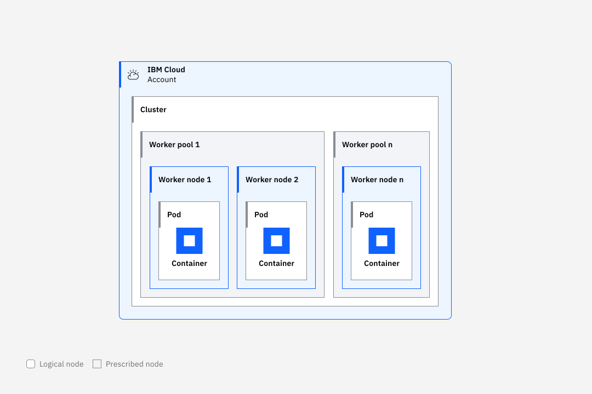

---

copyright:
  years: 2014, 2025
lastupdated: "2025-11-10"


keywords: kubernetes, openshift, red hat, red hat openshift

subcollection: openshift

content-type: tutorial
services: openshift
account-plan:
completion-time: 45m

---

{{site.data.keyword.attribute-definition-list}}


# Setting up your first classic cluster in the CLI
{: #openshift_tutorial}
{: toc-content-type="tutorial"}
{: toc-services="openshift"}
{: toc-completion-time="45m"}

[Classic infrastructure]{: tag-classic-inf}

In this tutorial, you deploy an {{site.data.keyword.openshiftlong_notm}} cluster on Classic infrastructure by using the CLI.
{: shortdesc}

## Audience
{: #openshift_audience}

This tutorial is designed for cluster administrators who want to learn how to create a {{site.data.keyword.openshiftlong_notm}} cluster for the first time by using the CLI. 

## Objectives
{: #openshift_objectives}

In this tutorial, you complete the following tasks.

- Create a cluster in Washington, DC with 2 worker nodes that have 4 cores and 16 GB memory.
- Open the {{site.data.keyword.redhat_openshift_notm}} web console.
- Deploy a sample app.
- Expose the app on a Route so that external users can access the service.

## What you'll get
{: #openshift_get}

In this tutorial, you create the following resources by using the CLI. There are optional steps to delete these resources if you don't want to keep them after completing the tutorial. 

- A classic cluster with 2 worker nodes
- A simple Hello World app deployed to your cluster
- A route to expose your app


## Overview of cluster resources
{: #cluster-arch-tut-overview}

Review the following diagram for an overview of common cluster resources.

{: caption="Cluster architecture" caption-side="bottom"}


## Prerequisites
{: #openshift_prereqs}


1. Check your permissions. If you are the account owner, you already have the required permissions to create a cluster and can continue to the next step. If you are not the account owner, ask the account owner to [set up an API key and assign you required permissions in {{site.data.keyword.cloud_notm}} IAM](/docs/openshift?topic=openshift-iam-platform-access-roles).


1. [Install the {{site.data.keyword.cloud_notm}} CLI tools](/docs/openshift?topic=openshift-cli-install).


## Create a {{site.data.keyword.openshiftlong_notm}} cluster
{: #openshift_create_cluster}
{: step}

1. Log in to your account and resource group. If you have a federated account, include the `--sso` option.
    ```sh
    ibmcloud login [-g RESOURCE GROUP] [--sso]
    ```
    {: pre}

1. Run the following command to create a version 4.19 cluster in Washington, DC with 2 worker nodes that have 4 cores and 16 GB memory.
    ```sh
    ibmcloud oc cluster create classic --name my-tutorial-cluster --location wdc04 --version 4.19_openshift --flavor b3c.4x16  --workers 2 --public-service-endpoint
    ```
    {: pre}


1. Your cluster creation might take some time to complete. After the cluster state shows **Normal**, the cluster network and Ingress components take about 10 more minutes to deploy and update the cluster domain that you use for the {{site.data.keyword.redhat_openshift_notm}} web console and other routes.


1. List your cluster details. Review the cluster **State**, check the **Ingress Subdomain**, and note the **Master URL**.
    
    ```sh
    ibmcloud oc cluster get --cluster <cluster_name_or_ID>
    ```
    {: pre}

1. Download and add the `kubeconfig` configuration file for your cluster.
    ```sh
    ibmcloud oc cluster config --cluster <cluster_name_or_ID>
    ```
    {: pre}

1. In your browser, navigate to the address of your **Master URL** and append `/console`. For example, `https://c0.containers.cloud.ibm.com:23652/console`.

1. Click your profile **IAM#user.name@email.com > Copy Login Command**. Display and copy the `oc login` token command into your command line to authenticate via the CLI.
    
1. Verify that the `oc` commands run properly with your cluster by checking the version.
    ```sh
    oc version
    ```
    {: pre}

    Example output

    ```sh
    Client Version: v4.19.0
    Kubernetes Version: v1.33.5.2
    ```
    {: screen}

    If you can't perform operations that require Administrator permissions, such as listing all the worker nodes or pods in a cluster, download the TLS certificates and permission files for the cluster administrator by running the `ibmcloud oc cluster config --cluster <cluster_name_or_ID> --admin` command.
    {: tip}

## Navigate the {{site.data.keyword.redhat_openshift_notm}} console
{: #openshift_oc_console}
{: step}


1. From the [console](https://cloud.ibm.com/containers/cluster-management/clusters){: external}, select your {{site.data.keyword.redhat_openshift_notm}} cluster, then click **OpenShift web console**.
2. To work with your cluster in the CLI, click your profile **`IAM#user.name@email.com` > Copy Login Command**. Display and copy the `oc login` token command into your command line to authenticate by using the CLI.


## Deploy an app to your cluster
{: #openshift_deploy_app}
{: step}


1. Create a project for your Hello World app.
    ```sh
    oc new-project hello-world
    ```
    {: pre}

1. Build the sample app [from the source code](https://github.com/IBM/container-service-getting-started-wt){: external} by using the `oc new-app` command.
    ```sh
    oc new-app --name hello-world https://github.com/IBM/container-service-getting-started-wt --context-dir="Lab 1"
    ```
    {: pre}
    
    A warning message might be displayed in the output, but it does not affect this example.

1. List the **hello-world** services and note the service name. Your app listens for traffic on these internal cluster IP addresses unless you create a route for the service so that the Ingress controller can forward external traffic requests to the app.
    ```sh
    oc get svc -n hello-world
    ```
    {: pre}

    Example output
    ```sh
    NAME          TYPE        CLUSTER-IP       EXTERNAL-IP   PORT(S)    AGE
    hello-world   ClusterIP   172.21.xxx.xxx   <none>       8080/TCP   31m
    ```
    {: screen}

1. List the pods and make sure that the **hello-world** pods status is **Running** and the `build` and `deploy` pods are **Completed**
    ```sh
    oc get pods -n hello-world
    ```
    {: pre}

    Example output
    ```sh
    NAME                  READY     STATUS             RESTARTS   AGE
    hello-world-1-9cv7d   1/1       Running            0          30m
    hello-world-1-build   0/1       Completed          0          31m
    hello-world-1-deploy  0/1       Completed          0          31m
    ```
    {: screen}

1. Set up a route so that you can publicly access the hello world service. 
    ```sh
    oc create route edge --service=hello-world -n hello-world
    ```
    {: pre}

1. Get the route hostname address from the **Host/Port** output.
    ```sh
    oc get route -n hello-world
    ```
    {: pre}

    Example output
    ```sh
    NAME          HOST/PORT                         PATH                                        SERVICES      PORT       TERMINATION   WILDCARD
    hello-world   hello-world-hello.world.CLUSTER-NAME-RANDOM-ID.REGION.containers.appdomain.cloud    hello-world   8080-tcp   edge/Allow    None
    ```
    {: screen}

1. Access your app. Be sure to append `https://` to your route hostname. It might take a minute before the exposed service is visible.
    ```sh
    curl https://hello-world-hello-world.CLUSTER-NAME-RANDOM-ID.REGION.containers.appdomain.cloud
    ```
    {: pre}

    Example output

    ```sh
    Hello world from hello-world-9cv7d! Your app is up and running in a cluster!
    ```
    {: screen}

## Clean up the tutorial resources
{: #openshift-tutorial-cleanup}
{: step}


1. List the resources in the `hello-world` project.
    ```sh
    oc get all -l app=hello-world -o name -n hello-world
    ```
    {: pre}

    Example output
    ```sh
    pod/hello-world-1-dh2ff
    replicationcontroller/hello-world-1
    service/hello-world
    deploymentconfig.apps.openshift.io/hello-world
    buildconfig.build.openshift.io/hello-world
    build.build.openshift.io/hello-world-1
    imagestream.image.openshift.io/hello-world
    imagestream.image.openshift.io/node
    route.route.openshift.io/hello-world
    ```
    {: screen}

1. Delete the resources.
    ```sh
    oc delete all -l app=hello-world -n hello-world
    ```
    {: pre}


## What's next?
{: #openshift_next}

For more information about working with your apps, see the [{{site.data.keyword.redhat_openshift_notm}} developer activities](https://docs.redhat.com/en/documentation/openshift_container_platform/4.19/html/about/welcome-index#developer-activities){: external} documentation.

Install two popular {{site.data.keyword.openshiftlong_notm}} cluster add-ons: [{{site.data.keyword.logs_full_notm}}](/docs/openshift?topic=openshift-health) and [{{site.data.keyword.mon_full_notm}}](/docs/openshift?topic=openshift-health-monitor).
