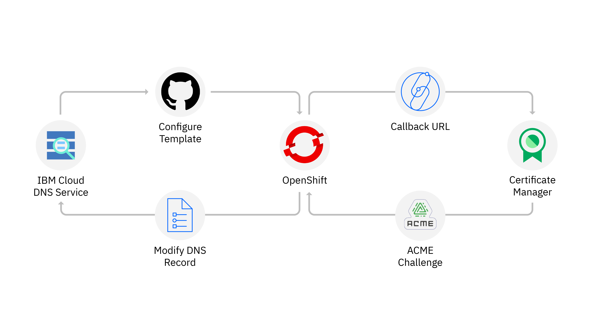

---

copyright:
  years: 2014, 2020
lastupdated: "2020-06-15"

keywords: openshift, roks, rhoks, rhos

subcollection: openshift

---

{:beta: .beta}
{:codeblock: .codeblock}
{:deprecated: .deprecated}
{:download: .download}
{:external: target="_blank" .external}
{:faq: data-hd-content-type='faq'}
{:gif: data-image-type='gif'}
{:help: data-hd-content-type='help'}
{:important: .important}
{:new_window: target="_blank"}
{:note: .note}
{:pre: .pre}
{:preview: .preview}
{:screen: .screen}
{:shortdesc: .shortdesc}
{:support: data-reuse='support'}
{:table: .aria-labeledby="caption"}
{:tip: .tip}
{:troubleshoot: data-hd-content-type='troubleshoot'}
{:tsCauses: .tsCauses}
{:tsResolve: .tsResolve}
{:tsSymptoms: .tsSymptoms}

# Tutorial overview
{: #tutorials-ov}

## Create a cluster and deploy apps
{: #tutorials-create-cluster-deploy-app}

  <a href = "/docs/openshift?topic=openshift-openshift_tutorial">
  

      

        {{site.data.keyword.openshiftlong_notm}} cluster
        

              

                 
Create an {{site.data.keyword.openshiftshort}} cluster with worker nodes that come installed with the {{site.data.keyword.openshiftshort}} container orchestration platform software.
 
                

                

                     
              

          

      

  

  </a>
    <a href = "/docs/openshift?topic=openshift-openshift_tutorial_vpc">
    

        

          {{site.data.keyword.openshiftshort}} cluster on VPC Gen 2
          

                

                   
Create an {{site.data.keyword.openshiftlong}} cluster in your Virtual Private Cloud with worker nodes on the next generation of compute infrastructure.
 
                  

                  

                     
                

            

        

    

    </a>
  <a href = "/docs/tutorials?topic=solution-tutorials-scalable-webapp-openshift">
    

        

          Scalable web app on {{site.data.keyword.openshiftshort}}
            

                

                    
Scaffold a web app, deploy it to a cluster, and learn how to scale your app and monitor its health. 
 
                

                

                    
                

            

        

    

  </a>
  <a href = "/docs/terraform?topic=terraform-redhat">
  

      

              Automate version 3.11 cluster creation with Terraform
          

              

                 
Use Terraform to automate the deployment of an {{site.data.keyword.openshiftlong_notm}} cluster that runs {{site.data.keyword.openshiftshort}} version 3.11.
 
              

              

                  
              

          

      

  

  </a>

## Dive deeper into {{site.data.keyword.openshiftshort}} technology
{: #tutorials-deep-dive}

    <a href = "https://developer.ibm.com/tutorials/automatic-security-certificate-renewal-OpenShift/">
    

        

                Security certificates for domains
          

                

                    
Renew security certificates automatically for web domains by using a DNS provider and IBM Cloud Certificate Manager with your Red Hat OpenShift on IBM Cloud cluster.
 
                

                

                    
                

            

        

    

    </a>
    <a href = "https://developer.ibm.com/tutorials/simplify-lifecycle-management-kubernetes-OpenShift-ibm-cloud-operator/">
    

        

                App lifecycle management with {{site.data.keyword.cloud_notm}} Operator
          

                

                    
Use the Operator Lifecycle Manager (OLM) and the {{site.data.keyword.cloud_notm}} Operator to simplify your app lifecycle management approach for {{site.data.keyword.cloud_notm}} services, third-party apps, and your own custom-built, cloud-native apps in your {{site.data.keyword.openshiftshort}} cluster.
 
                

                

                    
                

            

        

    

    </a>
    <a href = "https://learn.openshift.com">
    

        

                Red Hat OpenShift interactive learning portal
          

                

                    
Complete the courses and test out OpenShift concepts with a pre-configured OpenShift instance that is accessible from your browser.
 
                

                

                    
                

            

        

    

    </a>
    <a href = "https://www.katacoda.com/openshift">
    

        

                Katacoda site for learning OpenShift
          

                

                    
Learn how to use OpenShift to build, run, and scale your apps in the cloud so that you can focus on writing code.
 
                

                

                    
                

            

        

    

    </a>

