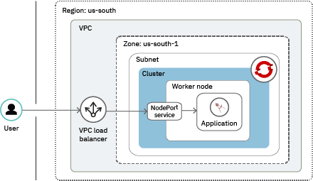

---

copyright:
  years: 2014, 2020
lastupdated: "2020-10-13"

keywords: kubernetes, iks, oks, iro, openshift, red hat, red hat openshift, rhos, roks, rhoks

subcollection: openshift

content-type: tutorial
services: openshift, vpc
account-plan:
completion-time: 45m

---

{:DomainName: data-hd-keyref="APPDomain"}
{:DomainName: data-hd-keyref="DomainName"}
{:android: data-hd-operatingsystem="android"}
{:apikey: data-credential-placeholder='apikey'}
{:app_key: data-hd-keyref="app_key"}
{:app_name: data-hd-keyref="app_name"}
{:app_secret: data-hd-keyref="app_secret"}
{:app_url: data-hd-keyref="app_url"}
{:authenticated-content: .authenticated-content}
{:beta: .beta}
{:c#: data-hd-programlang="c#"}
{:codeblock: .codeblock}
{:curl: .ph data-hd-programlang='curl'}
{:deprecated: .deprecated}
{:dotnet-standard: .ph data-hd-programlang='dotnet-standard'}
{:download: .download}
{:external: target="_blank" .external}
{:faq: data-hd-content-type='faq'}
{:fuzzybunny: .ph data-hd-programlang='fuzzybunny'}
{:generic: data-hd-operatingsystem="generic"}
{:generic: data-hd-programlang="generic"}
{:gif: data-image-type='gif'}
{:go: .ph data-hd-programlang='go'}
{:help: data-hd-content-type='help'}
{:hide-dashboard: .hide-dashboard}
{:hide-in-docs: .hide-in-docs}
{:important: .important}
{:ios: data-hd-operatingsystem="ios"}
{:java: #java .ph data-hd-programlang='java'}
{:java: .ph data-hd-programlang='java'}
{:java: data-hd-programlang="java"}
{:javascript: .ph data-hd-programlang='javascript'}
{:javascript: data-hd-programlang="javascript"}
{:new_window: target="_blank"}
{:note .note}
{:note: .note}
{:objectc data-hd-programlang="objectc"}
{:org_name: data-hd-keyref="org_name"}
{:php: data-hd-programlang="php"}
{:pre: .pre}
{:preview: .preview}
{:python: .ph data-hd-programlang='python'}
{:python: data-hd-programlang="python"}
{:route: data-hd-keyref="route"}
{:row-headers: .row-headers}
{:ruby: .ph data-hd-programlang='ruby'}
{:ruby: data-hd-programlang="ruby"}
{:runtime: architecture="runtime"}
{:runtimeIcon: .runtimeIcon}
{:runtimeIconList: .runtimeIconList}
{:runtimeLink: .runtimeLink}
{:runtimeTitle: .runtimeTitle}
{:screen: .screen}
{:script: data-hd-video='script'}
{:service: architecture="service"}
{:service_instance_name: data-hd-keyref="service_instance_name"}
{:service_name: data-hd-keyref="service_name"}
{:shortdesc: .shortdesc}
{:space_name: data-hd-keyref="space_name"}
{:step: data-tutorial-type='step'}
{:subsection: outputclass="subsection"}
{:support: data-reuse='support'}
{:swift: #swift .ph data-hd-programlang='swift'}
{:swift: .ph data-hd-programlang='swift'}
{:swift: data-hd-programlang="swift"}
{:table: .aria-labeledby="caption"}
{:term: .term}
{:tip: .tip}
{:tooling-url: data-tooling-url-placeholder='tooling-url'}
{:troubleshoot: data-hd-content-type='troubleshoot'}
{:tsCauses: .tsCauses}
{:tsResolve: .tsResolve}
{:tsSymptoms: .tsSymptoms}
{:tutorial: data-hd-content-type='tutorial'}
{:unity: .ph data-hd-programlang='unity'}
{:url: data-credential-placeholder='url'}
{:user_ID: data-hd-keyref="user_ID"}
{:vb.net: .ph data-hd-programlang='vb.net'}
{:video: .video}


# Creating an {{site.data.keyword.openshiftshort}} cluster in your Virtual Private Cloud (VPC)
{: #vpc_rh_tutorial}
{: toc-content-type="tutorial"}
{: toc-services="openshift, vpc"}
{: toc-completion-time="45m"}

Create an {{site.data.keyword.openshiftlong}} cluster on Virtual Private Cloud (VPC) Generation 2 compute.
{: shortdesc}

  With **{{site.data.keyword.openshiftlong_notm}} clusters on VPC Generation 2 compute**, you can create your cluster on VPC infrastructure in the next generation of the {{site.data.keyword.cloud_notm}} platform, in your [Virtual Private Cloud](/docs/vpc?topic=vpc-about-vpc).

* {{site.data.keyword.openshiftlong_notm}} gives you all the [advantages of a managed offering](/docs/openshift?topic=openshift-cs_ov) for your cluster infrastructure environment, while using the [{{site.data.keyword.openshiftshort}} tooling and catalog](https://docs.openshift.com/container-platform/4.3/welcome/index.html){: external} that runs on Red Hat Enterprise Linux for your app deployments.
* VPC gives you the security of a private cloud environment with the dynamic scalability of a public cloud. VPC uses the next version of {{site.data.keyword.openshiftlong_notm}} [infrastructure providers](/docs/openshift?topic=openshift-infrastructure_providers#infrastructure_providers), with a select group of v2 API, CLI, and console functionality.

{{site.data.keyword.openshiftshort}} worker nodes are available for paid accounts and standard clusters only. You can create {{site.data.keyword.openshiftshort}} clusters that run version 4 only. The operating system is Red Hat Enterprise Linux 7.
{: note}

## Objectives
{: #vpc_rh_objectives}

In the tutorial lessons, you create a {{site.data.keyword.openshiftlong_notm}} cluster in a Gen 2 Virtual Private Cloud (VPC). Then, you access built-in {{site.data.keyword.openshiftshort}} components, deploy an app in an {{site.data.keyword.openshiftshort}} project, and expose the app on with a VPC load balancer so that external users can access the service.

## Audience
{: #vpc_rh_audience}

This tutorial is for administrators who are creating a cluster in {{site.data.keyword.openshiftlong_notm}} in VPC Generation 2 compute for the first time.
{: shortdesc}

## Prerequisites
{: #vpc_rh_prereqs}

Ensure that you have the following {{site.data.keyword.cloud_notm}} IAM access policies.
* The [**Administrator** platform role for VPC Infrastructure](/docs/vpc?topic=vpc-managing-user-permissions-for-vpc-resources).
* The [**Administrator** platform role](/docs/openshift?topic=openshift-users#platform) for {{site.data.keyword.containerlong_notm}}
* The [**Writer** or **Manager** service role](/docs/openshift?topic=openshift-users#platform) for {{site.data.keyword.containerlong_notm}}
* The [**Administrator** platform role](/docs/openshift?topic=openshift-users#platform) for {{site.data.keyword.registrylong_notm}}
* If you want to use a resource group other than `default`, at least [**Viewer** platform role](/docs/openshift?topic=openshift-users#platform) for the resource group.

If this cluster is not the first cluster in the region and resource group, make sure that the API key for the region and resource group that you plan to create the cluster in is set up with the correct [infrastructure permissions](/docs/openshift?topic=openshift-users#api_key).

<br>
Install the command-line tools.
*   [Install the {{site.data.keyword.cloud_notm}} CLI (`ibmcloud`), {{site.data.keyword.containershort_notm}} plug-in (`ibmcloud oc`), and {{site.data.keyword.registrylong_notm}} plug-in (`ibmcloud cr`)](/docs/containers?topic=containers-cs_cli_install#cs_cli_install_steps).
*   [Install the {{site.data.keyword.openshiftshort}} (`oc`) and Kubernetes (`oc`) CLIs](/docs/openshift?topic=openshift-openshift-cli#cli_oc).
*   To work with VPC, install the `infrastructure-service` plug-in. The prefix for running commands is `ibmcloud is`.
    ```
    ibmcloud plugin install infrastructure-service
    ```
    {: pre}
*   Update your {{site.data.keyword.containershort_notm}} plug-in to the latest version.
    ```
    ibmcloud plugin update kubernetes-service
    ```
    {: pre}

<br />


## Creating a cluster in a VPC
{: #vpc_rh_create_vpc_cluster}
{: step}

Create an {{site.data.keyword.cloud_notm}} Virtual Private Cloud (VPC) environment. Then, create a {{site.data.keyword.openshiftlong_notm}} cluster on the VPC infrastructure. For more information about VPC, see [Getting Started with Virtual Private Cloud](/docs/vpc?topic=vpc-getting-started).
{: shortdesc}

1.  Log in to the account, resource group, and {{site.data.keyword.cloud_notm}} region where you want to create your VPC environment. The VPC must be set up in the same multizone metro location where you want to create your cluster. In this tutorial you create a VPC in `us-south`. For other supported regions, see [Multizone metros for VPC clusters](/docs/openshift?topic=openshift-regions-and-zones#zones). The VPC can be in a separate resource group than the resource group of your cluster. If you have a federated ID, include the `--sso` flag.
    ```
    ibmcloud login -r us-south [-g default] [--sso]
    ```
    {: pre}

2.  Create a VPC for your cluster. For more information, see the docs for creating a VPC in the [console](/docs/vpc?topic=vpc-creating-a-vpc-using-the-ibm-cloud-console) or [CLI](/docs/vpc?topic=vpc-creating-a-vpc-using-cli).
    1.  Target the VPC infrastructure generation 2.
        ```
        ibmcloud is target --gen 2
        ```
        {: pre}
    2.  Create a VPC that is called `myvpc` and note the **ID** in the output. VPCs provide an isolated environment for your workloads to run within the public cloud. You can use the same VPC for multiple clusters, such as if you plan to have different clusters host separate microservices that need to communicate with each other. If you want to separate your clusters, such as for different departments, you can create a VPC for each cluster.
        ```
        ibmcloud is vpc-create myvpc
        ```
        {: pre}
    3.  Create a public gateway and note the **ID** in the output. In the next step, you attach the public gateway to a VPC subnet, so that your worker nodes can communicate on the public network. Default {{site.data.keyword.openshiftshort}} components, such as the web console and OperatorHub, require public network access. If you skip this step, these {{site.data.keyword.openshiftshort}} components cannot run.
        ```
        ibmcloud is public-gateway-create gateway-us-south-1 <vpc_ID> us-south-1
        ```
        {: pre}
    4.  Create a subnet for your VPC, and note its **ID**. Consider the following information when you create the VPC subnet:
        *  **Zones**: You must have one VPC subnet for each zone in your cluster. The available zones depend on the metro location that you created the VPC in. To list available zones in the region, run `ibmcloud is zones`.
        *  **IP addresses**: VPC subnets provide private IP addresses for your worker nodes and load balancer services in your cluster, so make sure to [create a subnet with enough IP addresses](/docs/openshift?topic=openshift-vpc-subnets#vpc_basics_subnets), such as 256. You cannot change the number of IP addresses that a VPC subnet has later.
        *  **Public gateways**: Include the public gateway that you previously created. You must have one public gateway for each zone in your cluster.

        ```
        ibmcloud is subnet-create mysubnet1 <vpc_ID> --zone us-south-1 --ipv4-address-count 256 --public-gateway-id <gateway_ID>
        ```
        {: pre}

3. VPC Gen 2 clusters that run {{site.data.keyword.openshiftshort}} version 4.4 or earlier only: To allow any traffic requests to apps that you deploy on your worker nodes, modify the VPC's default security group.
    1. List your security groups. For the **VPC** that you created, note the ID of the default security group.
      ```
      ibmcloud is security-groups
      ```
      {: pre}
      Example output with only the default security group of a randomly generated name, `preppy-swimmer-island-green-refreshment`:
      ```
      ID                                     Name                                       Rules   Network interfaces         Created                     VPC                      Resource group
      1a111a1a-a111-11a1-a111-111111111111   preppy-swimmer-island-green-refreshment    4       -                          2019-08-12T13:24:45-04:00   <vpc_name>(bbbb222b-.)   c3c33cccc33c333ccc3c33cc3c333cc3
      ```
      {: screen}

    2. Add a security group rule to allow inbound TCP traffic on ports 30000-32767.
      ```
      ibmcloud is security-group-rule-add <security_group_ID> inbound tcp --port-min 30000 --port-max 32767
      ```
      {: pre}

    3. If you require VPC VPN access or classic infrastructure access into this cluster, add a security group rule to allow inbound UDP traffic on ports 30000-32767.
      ```
      ibmcloud is security-group-rule-add <security_group_ID> inbound udp --port-min 30000 --port-max 32767
      ```
      {: pre}
4.  Create a standard {{site.data.keyword.cos_full_notm}} instance to back up the internal registry in your cluster. In the output, note the instance **ID**.
    ```
    ibmcloud resource service-instance-create myvpc-cos cloud-object-storage standard global
    ```
    {: pre}
5.  Create a cluster in your VPC in the same zone as the subnet.
    * The following command creates a version 4.5 cluster in Dallas with the minimum configuration of 2 worker nodes that have at least 4 cores and 16 GB memory so that default {{site.data.keyword.openshiftshort}} components can deploy.
    * By default, your cluster is created with a public and a private service endpoint. You can use the public service endpoint to access the Kubernetes master, such as to run `oc` commands, from your local machine. Your worker nodes communicate with the master on the private service endpoint. For the purposes of this tutorial, do **not** specify the `--disable-public-service-endpoint` flag.
    * For more information about the command options, see the [`cluster create vpc-gen2` CLI reference docs](/docs/openshift?topic=openshift-kubernetes-service-cli#cli_cluster-create-vpc-gen2).
   ```
   ibmcloud oc cluster create vpc-gen2 --name myvpc-cluster --zone us-south-1 --version 4.5_openshift --flavor bx2.4x16 --workers 2 --vpc-id <vpc_ID> --subnet-id <vpc_subnet_ID> --cos-instance <cos_ID>
   ```
   {: pre}
6.  List your cluster details. Review the cluster **State**, check the **Ingress Subdomain**, and note the **Master URL**.<p class="note">Your cluster creation might take some time to complete. After the cluster state shows **Normal**, the cluster network and router components take about 10 more minutes to deploy and update the cluster domain that you use for the {{site.data.keyword.openshiftshort}} web console and other routes. Before you continue, wait until the cluster is ready by checking that the **Ingress Subdomain** follows a pattern of `<cluster_name>.<globally_unique_account_HASH>-0001.<region>.containers.appdomain.cloud`.</p>
  ```
  ibmcloud oc cluster get --cluster myvpc-cluster
  ```
  {: pre}
7.  Add yourself as a user to the {{site.data.keyword.openshiftshort}} cluster by setting the cluster context.
    ```
    ibmcloud oc cluster config --cluster myvpc-cluster --admin
    ```
    {: pre}
8.  In your browser, navigate to the address of your **Master URL** and append `/console`. For example, `https://c0.containers.cloud.ibm.com:23652/console`. If time permits, you can explore the different areas of the {{site.data.keyword.openshiftshort}} web console.
    <table aria-describedby="tableSummary-19ecbef4c01853826b42de82471b9035">
    <caption caption-side="top">
       {{site.data.keyword.openshiftshort}} console overview<br>
      <span class="table-summary" id="tableSummary-19ecbef4c01853826b42de82471b9035">The rows are read from left to right. The area of the console is in the first column, the location in the console is in the second column, and the description of the console area in the third column.</span>
    </caption>
    <thead>
    <tr>
    <th>Area</th>
    <th>Location in console</th>
    <th>Description</th>
    </tr>
    </thead>
    <tbody>
    <tr>
    <td>Administrator perspective</td>
    <td>Side navigation menu perspective switcher.</td>
    <td>From the Administrator perspective, you can manage and set up the components that your team needs to run your apps, such as projects for your workloads, networking, and operators for integrating IBM, Red Hat, 3rd party, and custom services into the cluster. For more information, see [Viewing cluster information](http://docs.openshift.com/container-platform/4.2/web_console/using-dashboard-to-get-cluster-information.html){: external} in the {{site.data.keyword.openshiftshort}} documentation.</td>
    </tr>
    <tr>
    <td>Developer perspective</td>
    <td>Side navigation menu perspective switcher.</td>
    <td>From the Developer perspective, you can add apps to your cluster in a variety of ways, such as from Git repositories,container images, drag-and-drop or uploaded YAML files, operator catalogs, and more. The **Topology** view presents a unique way to visualize the workloads that run in a project and navigate their components from sidebars that aggregate related resources, including pods, services, routes, and metadata. For more information, see [Developer perspective](http://docs.openshift.com/container-platform/4.2/web_console/odc-about-developer-perspective.html){: external} in the {{site.data.keyword.openshiftshort}} documentation.</td>
    </tr>
    </tbody>
    </table>
9.  From the {{site.data.keyword.openshiftshort}} web console menu bar, click your profile **IAM#user.name@email.com > Copy Login Command**. Display and copy the `oc login` token command into your terminal to authenticate via the CLI.<p class="tip">Save your cluster master URL to access the {{site.data.keyword.openshiftshort}} console later. In future sessions, you can skip the `cluster config` step and copy the login command from the console instead.</p>
10.  Verify that the `oc` commands run properly with your cluster by checking the version.
    ```
    oc version
    ```
    {: pre}

    Example output:
    ```
    Client Version: v4.5.0
    Kubernetes Version: v1.18.2
    ```
    {: screen}

    If you cannot perform operations that require Administrator permissions, such as listing all the worker nodes or pods in a cluster, download the TLS certificates and permission files for the cluster administrator by running the `ibmcloud oc cluster config --cluster myvpc-cluster --admin` command.
    {: tip}

<br />


## Deploying an app to your cluster
{: #vpc_rh_app}
{: step}

Quickly deploy a new sample app that is available to requests from inside the cluster only.
{: shortdesc}

The components that you deploy by completing this lesson are shown in the following diagram.


1.  Create an {{site.data.keyword.openshiftshort}} project for your Hello World app.
  ```
  oc new-project hello-world
  ```
  {: pre}

2.  Build the sample app [from the source code](https://github.com/IBM/container-service-getting-started-wt){: external}. With the {{site.data.keyword.openshiftshort}} `new-app` command, you can refer to a directory in a remote repository that contains the Dockerfile and app code to build your image. The command builds the image, stores the image in the local Docker registry, and creates the app deployment configurations (`dc`) and services (`svc`). For more information about creating new apps, [see the {{site.data.keyword.openshiftshort}} docs](http://docs.openshift.com/container-platform/4.3/applications/application_life_cycle_management/odc-creating-applications-using-developer-perspective.html){: external}.
    ```
    oc new-app --name hello-world https://github.com/IBM/container-service-getting-started-wt --context-dir="Lab 1"
    ```
    {: pre}

3.  Verify that the sample Hello World app components are created.

    1.  List the **hello-world** services and note the service name. So far, your app listens for traffic on these internal cluster IP addresses only. In the next lesson, you create a load balancer for the service so that the load balancer can forward external traffic requests to the app.
        ```
        oc get svc -n hello-world
        ```
        {: pre}

        Example output:
        ```
        NAME          TYPE        CLUSTER-IP       EXTERNAL-IP   PORT(S)    AGE
        hello-world   ClusterIP   172.21.xxx.xxx   <none>       8080/TCP   31m
        ```
        {: screen}

    2.  List the pods. Pods with `build` in the name are jobs that **Completed** as part of the new app build process. Make sure that the **hello-world** pod status is **Running**.
        ```
        oc get pods -n hello-world
        ```
        {: pre}

        Example output:
        ```
        NAME                  READY     STATUS             RESTARTS   AGE
        hello-world-1-9cv7d   1/1       Running            0          30m
        hello-world-1-build   0/1       Completed          0          31m
        hello-world-1-deploy  0/1       Completed          0          31m
        ```
        {: screen}

<br />


## Setting up a VPC load balancer to expose your app publicly
{: #vpc_rh_vpc_lb}
{: step}

Set up a VPC load balancer to expose your app to external requests on the public network.
{: shortdesc}

When you create a Kubernetes `LoadBalancer` service in your cluster, a VPC load balancer is automatically created in your VPC outside of your cluster. The VPC load balancer is multizonal and routes requests for your app through the private NodePorts that are automatically opened on your worker nodes. The following diagram illustrates how a user accesses an app's service through the VPC load balancer, even though your worker node is connected to only a private subnet.



Interested in using an {{site.data.keyword.openshiftshort}} route to expose your app instead? Check out [How does a request via route get to my app in a VPC cluster?](/docs/openshift?topic=openshift-openshift_routes#route_vpc) and [Setting up public routes](/docs/openshift?topic=openshift-openshift_routes#routes-setup).
{: tip}

</br>

1.  Create a Kubernetes `LoadBalancer` service in your cluster to publicly expose the hello world app.
    ```
    oc expose deployment/hello-world --type=LoadBalancer --name=hw-lb-svc  --port=8080 --target-port=8080
    ```
    {: pre}

    Example output:

    ```
    service "hw-lb-svc" exposed
    ```
    {: screen}

    <table summary=“Information about the expose command parameters. Columns are read left to right, with the first column the command parameter and the second column the description of the parameter.”>
    <caption>More about the expose parameters</caption>
    <thead>
    <col width="25%">
    <th>Parameter</th>
    <th>Description</th>
    </thead>
    <tbody>
    <tr>
    <td><code>expose</code></td>
    <td>Expose a Kubernetes resource, such as a deployment, as a service so that users can access the resource by using the VPC load balancer hostname.</td>
    </tr>
    <tr>
    <td><code>deployment/<em>&lt;hello-world-deployment&gt;</em></code></td>
    <td>The resource type and the name of the resource to expose with this service.</td>
    </tr>
    <tr>
    <td><code>--name=<em>&lt;hello-world-service&gt;</em></code></td>
    <td>The name of the service.</td>
    </tr>
    <tr>
    <td><code>--type=LoadBalancer</code></td>
    <td>The service type to create. In this lesson, you create a `LoadBalancer` service.</td>
    </tr>
    <tr>
    <td><code>--port=<em>&lt;8080&gt;</em></code></td>
    <td>The port on which the service listens for external network traffic.</td>
    </tr>
    <tr>
    <td><code>--target-port=<em>&lt;8080&gt;</em></code></td>
    <td>The port that your app listens on and to which the service directs incoming network traffic. In this example, the `target-port` is the same as the `port`, but other apps that you create might use a different port.</td>
    </tr>
    </tbody></table>

2.  Verify that the Kubernetes `LoadBalancer` service is created successfully in your cluster. When you create the Kubernetes `LoadBalancer` service, a VPC load balancer is automatically created for you. The VPC load balancer assigns a hostname to your Kubernetes `LoadBalancer` service that you can see in the **LoadBalancer Ingress** field of your CLI output. In VPC, services in your cluster are assigned a hostname because the external IP address for the service is not stable.<p class="note">The VPC load balancer takes a few minutes to provision in your VPC. Until the VPC load balancer is ready, you cannot access the Kubernetes `LoadBalancer` service through its hostname.</p>

    ```
    oc describe service hw-lb-svc
    ```
    {: pre}

    Example CLI output:
    ```
    Name:                     hw-lb-svc
    Namespace:                default
    Labels:                   app=hello-world-deployment
    Annotations:              <none>
    Selector:                 app=hello-world-deployment
    Type:                     LoadBalancer
    IP:                       172.21.xxx.xxx
    LoadBalancer Ingress:     1234abcd-us-south.lb.appdomain.cloud
    Port:                     <unset> 8080/TCP
    TargetPort:               8080/TCP
    NodePort:                 <unset> 32040/TCP
    Endpoints:
    Session Affinity:         None
    External Traffic Policy:  Cluster
    Events:
      Type    Reason                Age   From                Message
      ----    ------                ----  ----                -------
      Normal  EnsuringLoadBalancer  1m    service-controller  Ensuring load balancer
      Normal  EnsuredLoadBalancer   1m    service-controller  Ensured load balancer
    ```
    {: screen}

3.  Verify that the VPC load balancer is created successfully in your VPC. In the output, verify that the VPC load balancer has a **Provision Status** of `active` and an **Operating Status** of `online`.

    The VPC load balancer is named in the format `kube-<cluster_ID>-<kubernetes_lb_service_UID>`. To see your cluster ID, run `ibmcloud oc cluster get --cluster <cluster_name>`. To see the Kubernetes `LoadBalancer` service UID, run `kubectl get svc hw-lb-svc -o yaml` and look for the **metadata.uid** field in the output.
    {: tip}
    ```
    ibmcloud is load-balancers
    ```
    {: pre}

    In the following example CLI output, the VPC load balancer that is named `kube-bsaucubd07dhl66e4tgg-1f4f408ce6d2485499bcbdec0fa2d306` is created for the Kubernetes `LoadBalancer` service:
    ```
    ID                                          Name                                                         Family        Subnets               Is public   Provision status   Operating status   Resource group
    r006-d044af9b-92bf-4047-8f77-a7b86efcb923   kube-bsaucubd07dhl66e4tgg-1f4f408ce6d2485499bcbdec0fa2d306   Application   mysubnet-us-south-3   true        active             online             default
    ```
    {: screen}

4. Send a request to your app by curling the hostname and port of the Kubernetes `LoadBalancer` service that is assigned by the VPC load balancer that you found in step 2. Example:
    ```
    curl 1234abcd-us-south.lb.appdomain.cloud:8080
    ```
    {: pre}

    Example output:
    ```
    Hello world from hello-world-deployment-5fd7787c79-sl9hn! Your app is up and running in a cluster!
    ```
    {: screen}

5.  **Optional**: To clean up the resources that you created in this lesson, you can use the labels that are assigned to each app.
    1.  List all the resources for each app in the `hello-world` project.
        ```
        oc get all -l app=hello-world -o name -n hello-world
        ```
        {: pre}
        Example output:
        ```
        pod/hello-world-1-dh2ff
        replicationcontroller/hello-world-1
        service/hello-world
        deploymentconfig.apps.openshift.io/hello-world
        buildconfig.build.openshift.io/hello-world
        build.build.openshift.io/hello-world-1
        imagestream.image.openshift.io/hello-world
        imagestream.image.openshift.io/node
        ```
        {: screen}
    2.  Delete all the resources that you created.
        ```
        oc delete all -l app=hello-world -n hello-world
        ```
        {: pre}
<br />


## What's next?
{: #vpc_rh_next}

Now that you have a VPC cluster, learn more about what you can do.
{: shortdesc}

* [Backing up your internal image registry to {{site.data.keyword.cos_full_notm}}](/docs/openshift?topic=openshift-registry#cos_image_registry)
* [Overview of the differences between classic and VPC clusters](/docs/openshift?topic=openshift-infrastructure_providers)
* [VPC Gen 2 compute cluster limitations](/docs/openshift?topic=openshift-openshift_limitations#ks_vpc_gen2_limits)
* [About the v2 API](/docs/openshift?topic=openshift-cs_api_install#api_about)
* [Comparison of Classic and VPC commands for the CLI](/docs/openshift?topic=openshift-kubernetes-service-cli#cli_classic_vpc_about)

Need help, have questions, or want to give feedback on VPC clusters? Try posting in the [Slack channel](https://cloud.ibm.com/kubernetes/slack){: external}.
{: tip}
