---

copyright:
  years: 2014, 2025

lastupdated: "2025-12-04"

keywords: openshift, version, update, upgrade

subcollection: openshift

---

{{site.data.keyword.attribute-definition-list}}

# {{site.data.keyword.openshiftshort}} version information
{: #openshift_versions}

Review information about the supported {{site.data.keyword.redhat_openshift_notm}} versions for {{site.data.keyword.openshiftlong}} clusters.
{: shortdesc}

View information of version changes for major, minor, and patch updates that are available for your {{site.data.keyword.openshiftlong}} clusters. Changes include updates to {{site.data.keyword.redhat_openshift_notm}}, Kubernetes, and {{site.data.keyword.cloud_notm}} Provider components.

Unless otherwise noted in the change logs, the {{site.data.keyword.cloud_notm}} provider version enables {{site.data.keyword.redhat_openshift_notm}} APIs and features that are at beta. {{site.data.keyword.redhat_openshift_notm}} alpha features, which are subject to change, are disabled.

Check the [Security Bulletins on {{site.data.keyword.cloud_notm}} Status](https://cloud.ibm.com/status?selected=security) for security vulnerabilities that affect {{site.data.keyword.openshiftlong_notm}}. You can filter the results to view only **Kubernetes Service** security bulletins that are relevant to {{site.data.keyword.openshiftlong_notm}}. Change log entries that address other security vulnerabilities but don't also refer to an {{site.data.keyword.IBM_notm}} security bulletin are for vulnerabilities that are not known to affect {{site.data.keyword.openshiftlong_notm}} in normal usage. If you run privileged containers, run commands on the workers, or execute untrusted code, then you might be at risk.

Master patch updates are applied automatically. Worker node patch updates can be applied by reloading or updating the worker nodes. For more information about major, minor, and patch versions and preparation actions between minor versions, see [{{site.data.keyword.redhat_openshift_notm}} versions](/docs/openshift?topic=openshift-openshift_versions).

For more details about the {{site.data.keyword.redhat_openshift_notm}} and Kubernetes project versions, review the {{site.data.keyword.redhat_openshift_notm}} release notes.

## Available {{site.data.keyword.redhat_openshift_notm}} versions
{: #openshift_versions_available}

{{site.data.keyword.openshiftlong_notm}} supports the following versions of {{site.data.keyword.redhat_openshift_notm}}. Note that different {{site.data.keyword.redhat_openshift_notm}} versions might support different RHEL versions.

{: caption="Red Hat OpenShift version support timeline" caption-side="bottom"}

`†` Indicates dates that are tentative and subject to change.
`*` Indicates operating systems that are deprecated.

All VPC clusters created at version 4.18 or later can use RHCOS worker nodes. Clusters that were created at versions 4.15, 4.16, or 4.17 can only use RHCOS worker nodes if they were initially created with RHCOS worker nodes, or if they are upgraded to at least version 4.18. 
{: important}

<!--<qna:latest-version>-->

### VPC clusters
{: #os-vpc-gen2}

|Version|Release date|End of support|Operating systems|Related links|
|---|---|---|---|---|
|4.19 (Kubernetes 1.32) [Default]{: tag-purple} |3 September 2025|26 May 2027†|Red Hat CoreOS,  \nRHEL 9*| - [4.19 details and update actions](/docs/openshift?topic=openshift-cs_versions_419)  \n - [Change log](/docs/openshift?topic=openshift-openshift_changelog_419)  \n - [Release notes](https://docs.redhat.com/en/documentation/openshift_container_platform/4.19/html/release_notes/ocp-4-19-release-notes){: external}|
|4.18 (Kubernetes 1.31)|23 May 2025|26 May 2027†|Red Hat CoreOS,  \nRHEL 9*| - [4.18 details and update actions](/docs/openshift?topic=openshift-cs_versions_418)  \n - [Change log](/docs/openshift?topic=openshift-openshift_changelog_418)  \n - [Release notes](https://docs.redhat.com/en/documentation/openshift_container_platform/4.18/html/release_notes/ocp-4-18-release-notes){: external}|
|4.17 (Kubernetes 1.30)|20 November 2024|26 August 2026†|Red Hat CoreOS,  \nRHEL 9 (default),  \nRHEL 8| - [4.17 details and update actions](/docs/openshift?topic=openshift-cs_versions_417)  \n - [Change log](/docs/openshift?topic=openshift-openshift_changelog_417)  \n - [Release notes](https://docs.redhat.com/en/documentation/openshift_container_platform/4.17/html/release_notes/ocp-4-17-release-notes){: external}|
|4.16 (Kubernetes 1.29)|30 August 2024|26 August 2026†|Red Hat CoreOS,  \nRHEL 9 (default),  \nRHEL 8| - [4.16 details and update actions](/docs/openshift?topic=openshift-cs_versions_416)  \n - [Change log](/docs/openshift?topic=openshift-openshift_changelog_416)  \n - [Release notes](https://docs.redhat.com/en/documentation/openshift_container_platform/4.16/html/release_notes/ocp-4-16-release-notes){: external}|
|4.15 (Kubernetes 1.28) [Deprecated]{: tag-deprecated} |24 April 2024|08 January 2026|Red Hat CoreOS,  \nRHEL 8 (default)| - [4.15 details and update actions](/docs/openshift?topic=openshift-cs_versions_415)  \n - [Change log](/docs/openshift?topic=openshift-openshift_changelog_415)  \n - [Release notes](https://docs.redhat.com/en/documentation/openshift_container_platform/4.15/html/release_notes/ocp-4-15-release-notes){: external}|
|4.14 (Kubernetes 1.27) [Deprecated]{: tag-deprecated} |13 December 2023|08 January 2026|RHEL 8| - [4.14 details and update actions](/docs/openshift?topic=openshift-cs_versions_414)  \n - [Change log](/docs/openshift?topic=openshift-openshift_changelog_414)  \n - [Release notes](https://docs.redhat.com/en/documentation/openshift_container_platform/4.14/html/release_notes/ocp-4-14-release-notes){: external}|
{: caption="Available versions for VPC clusters" caption-side="bottom"}

### Classic clusters
{: #os-classic}

|Version|Release date|End of support|Operating systems|Related links|
|---|---|---|---|---|
|4.19 (Kubernetes 1.32) [Default]{: tag-purple} |3 September 2025|26 May 2027†|RHEL 9| - [4.19 details and update actions](/docs/openshift?topic=openshift-cs_versions_419)  \n - [Change log](/docs/openshift?topic=openshift-openshift_changelog_419)  \n - [Release notes](https://docs.redhat.com/en/documentation/openshift_container_platform/4.19/html/release_notes/ocp-4-19-release-notes){: external}|
|4.18 (Kubernetes 1.31)|23 May 2025|26 May 2027†|RHEL 9| - [4.18 details and update actions](/docs/openshift?topic=openshift-cs_versions_418)  \n - [Change log](/docs/openshift?topic=openshift-openshift_changelog_418)  \n - [Release notes](https://docs.redhat.com/en/documentation/openshift_container_platform/4.18/html/release_notes/ocp-4-18-release-notes){: external}|
|4.17 (Kubernetes 1.30)|20 November 2024|26 August 2026†|RHEL 9 (default),  \nRHEL 8| - [4.17 details and update actions](/docs/openshift?topic=openshift-cs_versions_417)  \n - [Change log](/docs/openshift?topic=openshift-openshift_changelog_417)  \n - [Release notes](https://docs.redhat.com/en/documentation/openshift_container_platform/4.17/html/release_notes/ocp-4-17-release-notes){: external}|
|4.16 (Kubernetes 1.29)|30 August 2024|26 August 2026†|RHEL 9 (default),  \nRHEL 8| - [4.16 details and update actions](/docs/openshift?topic=openshift-cs_versions_416)  \n - [Change log](/docs/openshift?topic=openshift-openshift_changelog_416)  \n - [Release notes](https://docs.redhat.com/en/documentation/openshift_container_platform/4.16/html/release_notes/ocp-4-16-release-notes){: external}|
|4.15 (Kubernetes 1.28) [Deprecated]{: tag-deprecated} |24 April 2024|08 January 2026|RHEL 8| - [4.15 details and update actions](/docs/openshift?topic=openshift-cs_versions_415)  \n - [Change log](/docs/openshift?topic=openshift-openshift_changelog_415)  \n - [Release notes](https://docs.redhat.com/en/documentation/openshift_container_platform/4.15/html/release_notes/ocp-4-15-release-notes){: external}|
|4.14 (Kubernetes 1.27) [Deprecated]{: tag-deprecated} |13 December 2023|08 January 2026|RHEL 8| - [4.14 details and update actions](/docs/openshift?topic=openshift-cs_versions_414)  \n - [Change log](/docs/openshift?topic=openshift-openshift_changelog_414)  \n - [Release notes](https://docs.redhat.com/en/documentation/openshift_container_platform/4.14/html/release_notes/ocp-4-14-release-notes){: external}|
{: caption="Available versions for Classic clusters" caption-side="bottom"}

### Clusters in Satellite locations
{: #os-sat}

|Version|Release date|End of support|Operating systems|Related links|
|---|---|---|---|---|
|4.19 (Kubernetes 1.32) [Default]{: tag-purple} |3 September 2025|26 May 2027†|Red Hat CoreOS,  \nRHEL 9| - [4.19 details and update actions](/docs/openshift?topic=openshift-cs_versions_419)  \n - [Change log](/docs/openshift?topic=openshift-openshift_changelog_419)  \n - [Release notes](https://docs.redhat.com/en/documentation/openshift_container_platform/4.19/html/release_notes/ocp-4-19-release-notes){: external}|
|4.18 (Kubernetes 1.31)|23 May 2025|26 May 2027†|Red Hat CoreOS,  \nRHEL 9| - [4.18 details and update actions](/docs/openshift?topic=openshift-cs_versions_418)  \n - [Change log](/docs/openshift?topic=openshift-openshift_changelog_418)  \n - [Release notes](https://docs.redhat.com/en/documentation/openshift_container_platform/4.18/html/release_notes/ocp-4-18-release-notes){: external}|
|4.17 (Kubernetes 1.30)|20 November 2024|26 August 2026†|Red Hat CoreOS,  \nRHEL 9,  \nRHEL 8 (default)| - [4.17 details and update actions](/docs/openshift?topic=openshift-cs_versions_417)  \n - [Change log](/docs/openshift?topic=openshift-openshift_changelog_417)  \n - [Release notes](https://docs.redhat.com/en/documentation/openshift_container_platform/4.17/html/release_notes/ocp-4-17-release-notes){: external}|
|4.16 (Kubernetes 1.29)|30 August 2024|26 August 2026†|Red Hat CoreOS,  \nRHEL 8 (default)| - [4.16 details and update actions](/docs/openshift?topic=openshift-cs_versions_416)  \n - [Change log](/docs/openshift?topic=openshift-openshift_changelog_416)  \n - [Release notes](https://docs.redhat.com/en/documentation/openshift_container_platform/4.16/html/release_notes/ocp-4-16-release-notes){: external}|
|4.15 (Kubernetes 1.28) [Deprecated]{: tag-deprecated} |24 April 2024|08 January 2026|Red Hat CoreOS,  \nRHEL 8 (default)| - [4.15 details and update actions](/docs/openshift?topic=openshift-cs_versions_415)  \n - [Change log](/docs/openshift?topic=openshift-openshift_changelog_415)  \n - [Release notes](https://docs.redhat.com/en/documentation/openshift_container_platform/4.15/html/release_notes/ocp-4-15-release-notes){: external}|
|4.14 (Kubernetes 1.27) [Deprecated]{: tag-deprecated} |13 December 2023|08 January 2026|Red Hat CoreOS,  \nRHEL 8 (default)| - [4.14 details and update actions](/docs/openshift?topic=openshift-cs_versions_414)  \n - [Change log](/docs/openshift?topic=openshift-openshift_changelog_414)  \n - [Release notes](https://docs.redhat.com/en/documentation/openshift_container_platform/4.14/html/release_notes/ocp-4-14-release-notes){: external}|
{: caption="Available versions for clusters in Satellite locations" caption-side="bottom"}

<!--</qna:latest-version>-->

`†` Indicates dates that are tentative and subject to change.
`*` Indicates operating systems that are deprecated.

Unsupported versions:
:    For information about unsupported versions, see the [archive](#version-archive). 

## Release lifecycle
{: #release_lifecycle}

Each supported version of {{site.data.keyword.openshiftlong_notm}} goes through a lifecycle of testing, development, general release, support, deprecation, and becoming unsupported. Review the descriptions of each phase of a version's lifecycle. 

Estimated days and versions are provided for general understanding. Actual availability and release dates are subject to change and depend on various factors, such as community updates, security patches, and technology changes between versions.
{: note}

1. **Community release**: The community releases the new version. IBM engineers begin testing and hardening the community version in preparation to release a supported {{site.data.keyword.openshiftlong_notm}} version.
2. **Supported version lifecycle**:
    
    Development release
    :   Release is under development and might be available as a Beta to select customers. IBM provides best effort support for the release.

    General availability
    :   Release is generally available (GA). IBM provides full support for the release. IBM provides a tentative target date for the release to be unsupported. Release becomes the default version used during cluster creation once there are minimal restrictions and a reasonable adoption rate for the release.

    Maintenance
    :   Release has entered maintenance support as defined by Red Hat support. IBM provides maintenance support for OpenShift based on Red Hat policy. IBM provides full support otherwise.

    Extended support
    :   Release has entered extended support as defined by Red Hat. IBM provides extended support for OpenShift based on Red Hat policy. IBM provides full support otherwise.

3. **Deprecated version**: The version is deprecated. IBM provides an updated unsupported target date for the release. An unsupported countdown to this date is provided at least 45 days before the release becomes unsupported. IBM provides minimal support for the release in alignment with Red Hat support. This support phase is generally the final phase before the release becomes unsupported and overrides the maintenance and extended support phases should there be any overlap. Security patch updates might not be provided. During the deprecation period, the version is still supported and your cluster is still functional, but might require updating to a supported release to fix security vulnerabilities. For example, by adding or reloading worker nodes.

4. **Unsupported version**: The version is unsupported. IBM only provides support to upgrade to a supported release. The version is unsupported. Unsupported clusters are not provided with security and patch updates and are not supported by {{site.data.keyword.cloud_notm}} Support. Although your cluster and apps might continue to run for a time, you can no longer create, reload, or take other corrective actions on your cluster master or worker nodes when an issue occurs. You can still delete the cluster or worker nodes, or update the cluster to the next version. Review the potential impacts and immediately [update the cluster](/docs/openshift?topic=openshift-update#update) to continue receiving important security updates and support. If the cluster master runs two or more versions behind the oldest supported version, you can no longer apply updates and must delete the cluster and create a new one.

Clusters running an unsupported version will eventually fail because cluster certificates expire. Failures might include, but aren't limited to, an unavailable cluster control plane, `NotReady` worker nodes, or an unhealthy Ingress.
{: important}

5. **Archived**: The version is unsupported with no upgrade path. IBM provides no support. IBM reserves the right to shut down the control planes for such clusters.

IBM provides bi-weekly worker node fix packs. IBM's goal is to remediate detected, legitimate vulnerabilities within an appropriate time for the risks they represent. To ensure the quality and stability of the release, fix packs might be delayed.

For {{site.data.keyword.redhat_openshift_notm}}, fix packs are applied to the latest minor release and patch for the targeted operating system. 
- For RHEL8 that is 8.9.

To keep your nodes secure, you must install worker node fix packs as soon as possible. You can subscribe to notifications to be alerted when a new update is available.

## Archive
{: #version-archive}

Unsupported clusters are not provided with security and patch updates and are not supported by {{site.data.keyword.cloud_notm}} Support. Although your cluster and apps might continue to run for a time, you can no longer create, reload, or take other corrective actions on your cluster master or worker nodes when an issue occurs. You can still delete the cluster or worker nodes, or update the cluster to the next version. Review the potential impacts and immediately [update the cluster](/docs/openshift?topic=openshift-update#update) to continue receiving important security updates and support. If your cluster master is two or more versions behind the oldest supported version, you must [make a new cluster](/docs/openshift?topic=openshift-clusters#clusters) and [deploy your apps](/docs/openshift?topic=openshift-deploy_app) to the new cluster.
{: shortdesc}

**Unsupported {{site.data.keyword.openshiftshort}} versions**: 
:   [Archived version history](/docs/openshift?topic=openshift-sitemap#sitemap_archived_version_history)
